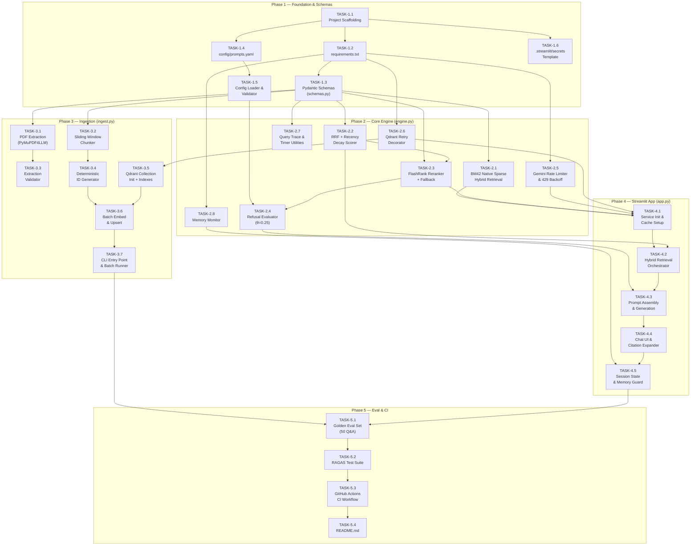

# Implementation Execution Plan — WealthChronicle AI v1.0

**Document Role:** Single Source of Truth & Master Execution Checklist for Coding Agent  
**Upstream Contracts:** [PRD.md](file:///c:/Users/S/OneDrive/Desktop/WealthRag/PRD.md) · [TECH_SPEC.md](file:///c:/Users/S/OneDrive/Desktop/WealthRag/TECH_SPEC.md)  
**Date:** 2026-08-29  

---

## 1. Milestone & Dependency Roadmap

### 1.1 Phased Dependency Graph



### 1.2 Critical Path

```text
T1.1 → T1.2 → T1.3 → T2.2 → T2.3 → T2.4 → T4.2 → T4.3 → T4.4 → T5.1 → T5.2 → T5.3 → T5.4
                 │                                      ▲
                 └──→ T3.2 → T3.4 → T3.6 → T3.7 ──────┘
```

### 1.3 Complexity & Effort Estimates

| Phase | Description | Files Produced | Estimated Complexity | Approx. Lines of Code |
|-------|-------------|----------------|----------------------|-----------------------|
| **Phase 1** | Foundation & Schemas | 6 files | 🟢 Low | ~350 |
| **Phase 2** | Core Engine | 1 file (`engine.py`) | 🟡 Medium-High | ~550 |
| **Phase 3** | Ingestion Pipeline | 1 file (`ingest.py`) | 🟡 Medium | ~300 |
| **Phase 4** | Streamlit App | 1 file (`app.py`) | 🟡 Medium-High | ~350 |
| **Phase 5** | Eval & CI | 4 files | 🟢 Medium-Low | ~250 |
| | | **Total: ~14 files** | | **~1,800** |

---

## 2. Granular Task Breakdown

---

### PHASE 1: Foundation, Schemas & Environment

---

#### TASK-1.1: Project Scaffolding & Directory Structure

**Target File(s):**
- `wealth_chronicle_rag/` (root directory)
- `.gitignore`

**Specific Responsibilities:**
1. Create the full directory tree exactly matching PRD §5:
   ```
   wealth_chronicle_rag/
   ├── .github/workflows/
   ├── .streamlit/
   ├── config/
   ├── tests/
   ├── data/                  # Local PDF storage (gitignored)
   └── (root files)
   ```
2. Create `.gitignore` with entries for:
   - Python bytecode (`__pycache__/`, `*.pyc`)
   - Virtual environments (`venv/`, `.venv/`)
   - IDE configs (`.idea/`, `.vscode/`)
   - Secrets (`.streamlit/secrets.toml`, `.env`)
   - Data directory (`data/`)
   - Model caches (`/tmp/models/`)
   - Evaluation output (`eval_results.txt`)

**Pydantic Schemas Touched:** None.

**Verification Command:**
```bash
# Verify directory structure exists
find wealth_chronicle_rag -type d | sort
# Expected: .github/workflows, .streamlit, config, tests, data
```

**Acceptance Criteria:**
- [x] All directories exist and are empty (except for `.gitignore`).
- [x] `.gitignore` prevents committing secrets and data files.

---

#### TASK-1.2: Dependency Manifest (`requirements.txt`)

**Target File(s):**
- `requirements.txt`

**Specific Responsibilities:**
1. Create `requirements.txt` with exact minimum versions from TECH_SPEC Appendix A:
   ```text
   pymupdf4llm>=0.0.10
   fastembed>=0.3.0
   qdrant-client>=1.9.0
   flashrank>=0.2.0
   bm25s>=0.2.0
   google-generativeai>=0.5.0
   streamlit>=1.35.0
   pyyaml>=6.0
   pydantic>=2.7.0
   psutil>=5.9.0
   ```

**Pydantic Schemas Touched:** None.

**Verification Command:**
```bash
python -m venv venv && source venv/bin/activate  # or venv\Scripts\activate on Windows
pip install -r requirements.txt
python -c "import pymupdf4llm, fastembed, qdrant_client, flashrank, bm25s, google.generativeai, streamlit, yaml, pydantic, psutil; print('All imports OK')"
```

**Acceptance Criteria:**
- [x] `pip install -r requirements.txt` completes with zero errors.
- [x] All 10 packages importable in a single Python statement.

---

#### TASK-1.3: Pydantic Data Contracts (`schemas.py`)

**Target File(s):**
- `schemas.py`

**Specific Responsibilities:**
Implement every data model from TECH_SPEC §2.2 verbatim:

1. **`ChunkPayload`** — Qdrant point payload schema (FR-ING-04).
   - Fields: `chunk_id` (regex-validated), `edition_date` (date with string parser), `page_number` (1–200), `article_title` (optional), `text` (120–8000 chars), `source` (default "Weekly Financial Dossier"), `char_count` (≥120), `word_count` (≥20), `ingested_at` (UTC datetime).
   - Include `@field_validator("edition_date")` for ISO string → `date` coercion.

2. **`RetrievalSource`** — Enum: `DENSE`, `SPARSE`, `HYBRID`.

3. **`SearchResult`** — Raw retrieval candidate.
   - Fields: `point_id`, `text`, `payload` (ChunkPayload), `score`, `source` (RetrievalSource), `dense_rank` (optional), `sparse_rank` (optional).

4. **`RerankedPassage`** — Post-reranking passage.
   - Fields: `point_id`, `text`, `payload`, `cross_encoder_score` (0.0–1.0), `rrf_score`, `time_decay_multiplier` (≥1.0), `final_rank` (1–20).

5. **`CitationMetadata`** — UI citation block.
   - Fields: `edition_date`, `page_number`, `article_title`, `cross_encoder_score`, `excerpt_preview` (max 300 chars).

6. **`EvaluationCategory`** — Enum: `TAX_REGIME`, `MUTUAL_FUNDS`, `INSURANCE_CLAIMS`, `RETIREMENT_NPS`, `ESTATE_SUCCESSION`.

7. **`EvaluationItem`** — Golden dataset entry.
   - Fields: `id` (regex `eval_\d{3}`), `category`, `question`, `ground_truth`, `source_edition_dates` (list[date]), `source_pages` (list[int]), `difficulty`.

**Pydantic Schemas Touched:** All 7 models created.

**Verification Command:**
```bash
python -c "
from schemas import ChunkPayload, SearchResult, RerankedPassage, CitationMetadata, EvaluationItem, EvaluationCategory, RetrievalSource
# Test ChunkPayload construction
cp = ChunkPayload(
    chunk_id='chk_2026_08_24_p14_002',
    edition_date='2026-08-24',
    page_number=14,
    text='A' * 120,
    char_count=120,
    word_count=20,
)
assert cp.edition_date.year == 2026
# Test EvaluationItem
ei = EvaluationItem(
    id='eval_001', category='tax_regime',
    question='What is the LTCG rate?',
    ground_truth='The LTCG rate is 12.5 percent.',
    source_edition_dates=['2025-08-03'],
    source_pages=[8],
)
assert ei.category == EvaluationCategory.TAX_REGIME
print('All schema validations passed.')
"
```

**Acceptance Criteria:**
- [x] All 7 models instantiate without error with valid data.
- [x] Invalid data (e.g., `chunk_id` not matching regex, `page_number=0`) raises `ValidationError`.
- [x] `edition_date` accepts both `str` and `date` types.

---

#### TASK-1.4: Version-Controlled Prompt Configuration (`config/prompts.yaml`)

**Target File(s):**
- `config/prompts.yaml`

**Specific Responsibilities:**
Create the YAML file exactly matching TECH_SPEC §5.1.1:

1. `prompt_version: "1.0.0"` — version tracking.
2. `system_prompt` — 5 hard-coded guardrails (grounding-only, date citations, historical changes, no buy/sell/hold, sunset clauses).
3. `rag_prompt_template` — Template with `{context}` and `{query}` variables. Includes citation format instruction `[Edition: YYYY-MM-DD | Page: N]`.
4. `refusal_message` — Deterministic refusal text (bypasses LLM).
5. `refusal_config` block:
   - `cross_encoder_min_score: 0.25` ($\theta$)
   - `min_relevant_chunks: 1`

**Pydantic Schemas Touched:** None (consumed by TASK-1.5 validator).

**Verification Command:**
```bash
python -c "
import yaml
with open('config/prompts.yaml') as f:
    c = yaml.safe_load(f)
assert 'system_prompt' in c
assert 'rag_prompt_template' in c
assert '{context}' in c['rag_prompt_template']
assert '{query}' in c['rag_prompt_template']
assert 'refusal_message' in c
assert c['refusal_config']['cross_encoder_min_score'] == 0.25
assert c['refusal_config']['min_relevant_chunks'] == 1
print('prompts.yaml validated.')
"
```

**Acceptance Criteria:**
- [x] YAML loads without errors.
- [x] Template variables `{context}` and `{query}` present in `rag_prompt_template`.
- [x] `refusal_config` contains both threshold keys with correct default values.

---

#### TASK-1.5: Configuration Loader & Validator

**Target File(s):**
- `engine.py` (first function: `load_and_validate_prompts`)

**Specific Responsibilities:**
Implement `load_and_validate_prompts()` from TECH_SPEC §5.1.2:

1. Load YAML from `config/prompts.yaml` (configurable path).
2. Validate 4 required top-level keys: `system_prompt`, `rag_prompt_template`, `refusal_message`, `refusal_config`.
3. Use `string.Formatter.parse()` to verify `{context}` and `{query}` exist in `rag_prompt_template`.
4. Raise `FileNotFoundError`, `KeyError`, or `ValueError` on failures.

**Pydantic Schemas Touched:** None (pure dict return).

**Verification Command:**
```bash
python -c "
from engine import load_and_validate_prompts
config = load_and_validate_prompts('config/prompts.yaml')
assert 'system_prompt' in config
assert 'refusal_config' in config
print('Config loader validated.')
"
```

**Acceptance Criteria:**
- [x] Returns a valid dict with all required keys when config is correct.
- [x] Raises `FileNotFoundError` when path is wrong.
- [x] Raises `KeyError` when a required key is removed from YAML.
- [x] Raises `ValueError` if `{context}` is removed from `rag_prompt_template`.

---

#### TASK-1.6: Streamlit Secrets Template

**Target File(s):**
- `.streamlit/secrets.toml.template`

**Specific Responsibilities:**
Create a template file (committed to repo, NOT actual secrets):
```toml
# Copy this file to .streamlit/secrets.toml and fill in real values.
# .streamlit/secrets.toml is gitignored and must NEVER be committed.

GEMINI_API_KEY = "your-gemini-api-key-here"
QDRANT_URL = "https://your-cluster-id.region.aws.cloud.qdrant.io:6333"
QDRANT_READ_KEY = "your-qdrant-read-only-api-key-here"
```

**Pydantic Schemas Touched:** None.

**Verification Command:**
```bash
test -f .streamlit/secrets.toml.template && echo "Template exists" || echo "MISSING"
```

**Acceptance Criteria:**
- [x] Template file exists and contains all 3 secret keys.
- [x] `.gitignore` includes `.streamlit/secrets.toml` (NOT the template).

---

### PHASE 2: Core Shared Engine (`engine.py`)

> All tasks in this phase add functions to `engine.py`. The file was started in TASK-1.5.

---

#### TASK-2.1: BM25 Index Builder

**Target File(s):**
- `engine.py` (append class `BM25Index`)

**Specific Responsibilities:**
Implement `BM25Index` class from TECH_SPEC §4.1.2:

1. `__init__(self, corpus_texts: list[str], corpus_ids: list[str])` — Tokenize corpus with `bm25s.tokenize(stopwords="en")`, build index via `bm25s.BM25().index()`.
2. `search(self, query: str, limit: int = 12) -> list[tuple[str, float]]` — Tokenize query, retrieve top-k, return `(point_id, bm25_score)` tuples filtered to `score > 0`.

**Pydantic Schemas Touched:** None directly (returns raw tuples consumed by RRF in TASK-2.2).

**Verification Command:**
```bash
python -c "
from engine import BM25Index
idx = BM25Index(
    corpus_texts=['tax slab income rate', 'mutual fund NAV returns', 'health insurance claim'],
    corpus_ids=['id_1', 'id_2', 'id_3'],
)
results = idx.search('income tax slab', limit=2)
assert len(results) > 0
assert results[0][0] in ('id_1', 'id_2', 'id_3')
print(f'BM25 search returned {len(results)} results. Top: {results[0]}')
"
```

**Acceptance Criteria:**
- [x] Index builds without error on a 3-document corpus.
- [x] `search()` returns results sorted by descending BM25 score.
- [x] Results with `score == 0` are excluded.

---

#### TASK-2.2: Reciprocal Rank Fusion (RRF) + Exponential Recency Decay

**Target File(s):**
- `engine.py` (append constants and function `reciprocal_rank_fusion`)

**Specific Responsibilities:**
Implement from TECH_SPEC §4.2:

1. Define module-level constants:
   - `RRF_K: int = 60`
   - `RECENCY_ALPHA: float = 0.35`
   - `RECENCY_TAU: float = 365.0`

2. Implement `reciprocal_rank_fusion(dense_results, sparse_results, all_payloads, reference_date, top_n)`:
   - Build `dense_rank_map` and `sparse_rank_map` from input lists.
   - Union all candidate point IDs.
   - For each candidate: compute `rrf_score = 1/(k + r_d) + 1/(k + r_s)` where missing ranks → `float("inf")`.
   - Compute `recency = 1.0 + α · exp(-Δt / τ)` from `payload.edition_date`.
   - `final_score = rrf_score × recency`.
   - Sort descending, return top `top_n` dicts.

**Math reference:**
$$\text{Score}(d) = \left(\frac{1}{60+r_d}+\frac{1}{60+r_s}\right) \times \left(1.0+0.35 \cdot e^{-\Delta t / 365}\right)$$

**Pydantic Schemas Touched:** Reads `SearchResult.point_id`, `SearchResult.dense_rank`; reads `ChunkPayload.edition_date` from `all_payloads` dict.

**Verification Command:**
```bash
python -c "
from engine import reciprocal_rank_fusion
from schemas import ChunkPayload, SearchResult, RetrievalSource
from datetime import date

# Create mock data
payload = ChunkPayload(
    chunk_id='chk_2026_08_24_p01_000', edition_date='2026-08-24',
    page_number=1, text='A'*120, char_count=120, word_count=20,
)
dense = [SearchResult(
    point_id='abc', text='test', payload=payload,
    score=0.9, source=RetrievalSource.DENSE, dense_rank=1,
)]
sparse = [('abc', 5.2)]
payloads = {'abc': payload}

result = reciprocal_rank_fusion(dense, sparse, payloads, reference_date=date(2026, 8, 29))
assert len(result) == 1
assert result[0]['point_id'] == 'abc'
assert result[0]['recency_multiplier'] > 1.0
print(f'RRF score: {result[0][\"final_score\"]:.6f}, recency: {result[0][\"recency_multiplier\"]:.4f}')
"
```

**Acceptance Criteria:**
- [x] Document appearing in both retrievers gets a higher RRF score than one in only one.
- [x] Recency multiplier for `Δt = 0` equals exactly `1.35`.
- [x] Recency multiplier for `Δt = 365` ≈ `1.129` (within ±0.002).
- [x] Output is sorted by `final_score` descending and capped at `top_n`.

---

#### TASK-2.3: FlashRank Cross-Encoder Reranker with Graceful Fallback

**Target File(s):**
- `engine.py` (append function `rerank_candidates` + init pattern)

**Specific Responsibilities:**
Implement from TECH_SPEC §4.3.3 and §4.3.4:

1. `rerank_candidates(query, candidates, payload_map, ranker, top_k=4) -> list[RerankedPassage]`:
   - Build passage list `[{"id": point_id, "text": text}, ...]` from RRF candidates.
   - Call `ranker.rerank(RerankRequest(query=query, passages=passages))`.
   - Map reranked results back to `RerankedPassage` Pydantic objects with `cross_encoder_score`, `rrf_score`, `time_decay_multiplier`, `final_rank`.
   - Return top-k.

2. Document the graceful fallback pattern:
   - If `ranker is None` (FlashRank init failed), skip reranking entirely.
   - Instead, construct `RerankedPassage` objects from the top-4 RRF candidates with `cross_encoder_score=0.0`.

**Pydantic Schemas Touched:** Returns `list[RerankedPassage]`; reads from `ChunkPayload` via `payload_map`.

**Verification Command:**
```bash
python -c "
from engine import rerank_candidates
from schemas import ChunkPayload, RerankedPassage
from flashrank import Ranker

ranker = Ranker(model_name='ms-marco-TinyBERT-L-2-v2', cache_dir='/tmp/models')
payload = ChunkPayload(
    chunk_id='chk_2026_08_24_p01_000', edition_date='2026-08-24',
    page_number=1, text='Income tax rates for FY 2025-26 under the new regime are structured in slabs.'*3,
    char_count=200, word_count=30,
)
candidates = [{'point_id': 'abc', 'rrf_score': 0.03, 'recency_multiplier': 1.3, 'final_score': 0.04}]
payload_map = {'abc': payload}

results = rerank_candidates('What are the income tax slabs?', candidates, payload_map, ranker, top_k=1)
assert len(results) == 1
assert isinstance(results[0], RerankedPassage)
assert 0.0 <= results[0].cross_encoder_score <= 1.0
print(f'Cross-encoder score: {results[0].cross_encoder_score:.4f}')
"
```

**Acceptance Criteria:**
- [x] Returns `list[RerankedPassage]` with correct Pydantic validation.
- [x] `cross_encoder_score` is in `[0.0, 1.0]`.
- [x] When `ranker=None` (fallback mode), returns RRF-ordered results with `cross_encoder_score=0.0`.

---

#### TASK-2.4: Deterministic Refusal Evaluator (`should_refuse`)

**Target File(s):**
- `engine.py` (append function `should_refuse`)

**Specific Responsibilities:**
Implement from TECH_SPEC §5.3.1:

1. `should_refuse(reranked: list[RerankedPassage], config: dict) -> bool`:
   - Extract `theta = config["refusal_config"]["cross_encoder_min_score"]` (default 0.25).
   - Extract `min_chunks = config["refusal_config"]["min_relevant_chunks"]` (default 1).
   - Return `True` (refuse) if ANY of:
     - `len(reranked) == 0` (empty retrieval)
     - `reranked[0].cross_encoder_score < theta` (top-1 score too low)
     - Count of passages with `score >= theta` is `< min_chunks`
   - Return `False` → proceed with LLM generation.

**Pydantic Schemas Touched:** Reads `RerankedPassage.cross_encoder_score`.

**Verification Command:**
```bash
python -c "
from engine import should_refuse
from schemas import RerankedPassage, ChunkPayload

config = {'refusal_config': {'cross_encoder_min_score': 0.25, 'min_relevant_chunks': 1}}
payload = ChunkPayload(
    chunk_id='chk_2026_08_24_p01_000', edition_date='2026-08-24',
    page_number=1, text='A'*120, char_count=120, word_count=20,
)

# Test 1: Empty → refuse
assert should_refuse([], config) == True

# Test 2: Low score → refuse
low = RerankedPassage(point_id='a', text='x', payload=payload,
    cross_encoder_score=0.10, rrf_score=0.01, time_decay_multiplier=1.0, final_rank=1)
assert should_refuse([low], config) == True

# Test 3: High score → proceed
high = RerankedPassage(point_id='b', text='x', payload=payload,
    cross_encoder_score=0.60, rrf_score=0.02, time_decay_multiplier=1.2, final_rank=1)
assert should_refuse([high], config) == False

print('Refusal evaluator: all 3 cases passed.')
"
```

**Acceptance Criteria:**
- [x] Returns `True` for empty list.
- [x] Returns `True` when top-1 score = 0.24 (below threshold).
- [x] Returns `False` when top-1 score = 0.25 (at threshold).
- [x] Returns `False` when top-1 score = 0.80 (well above threshold).

---

#### TASK-2.5: Gemini Rate Limiter & 429 Backoff

**Target File(s):**
- `engine.py` (append classes `GeminiRateLimiter` and function `safe_generate`)

**Specific Responsibilities:**
Implement from TECH_SPEC §7.4:

1. `GeminiRateLimiter(max_rpm=14)`:
   - Thread-safe token-bucket with `threading.Lock`.
   - `acquire()` blocks until `60.0 / max_rpm` seconds have elapsed since last request.
   - Interval = ~4.3s (stays 1 under the 15 RPM free-tier limit).

2. `safe_generate(model, prompt, rate_limiter) -> str`:
   - Call `rate_limiter.acquire()` before each request.
   - Try `model.generate_content(prompt)` up to 3 times.
   - On `google.api_core.exceptions.ResourceExhausted`: backoff 5s, 10s, 20s.
   - After 3 failures: return user-friendly "service busy" message.

**Pydantic Schemas Touched:** None (operates on raw strings).

**Verification Command:**
```bash
python -c "
from engine import GeminiRateLimiter
import time

limiter = GeminiRateLimiter(max_rpm=60)  # 1 per second for fast test
start = time.monotonic()
limiter.acquire()
limiter.acquire()
elapsed = time.monotonic() - start
assert elapsed >= 0.9, f'Rate limiter too fast: {elapsed:.2f}s'
print(f'Rate limiter OK: 2 acquires in {elapsed:.2f}s (expected ~1s)')
"
```

**Acceptance Criteria:**
- [x] Two consecutive `acquire()` calls take at least `60/max_rpm` seconds.
- [x] Thread-safe (no race conditions under concurrent Streamlit sessions).
- [x] `safe_generate` returns a string on success and a fallback message after 3 failures.

---

#### TASK-2.6: Qdrant Retry Decorator

**Target File(s):**
- `engine.py` (append `QdrantRetryConfig` class and `with_qdrant_retry` decorator)

**Specific Responsibilities:**
Implement from TECH_SPEC §7.2:

1. `QdrantRetryConfig` with:
   - `MAX_RETRIES = 3`
   - `BASE_DELAY_S = 0.5`
   - `MAX_DELAY_S = 8.0`
   - `JITTER_RANGE = 0.25`
   - `RETRYABLE_STATUS_CODES = {429, 502, 503, 504}`

2. `@with_qdrant_retry` decorator:
   - Catch `UnexpectedResponse`, `ResponseHandlingException`, `ConnectionError`.
   - Retry up to `MAX_RETRIES` times with exponential backoff: `delay = min(BASE_DELAY * 2^attempt, MAX_DELAY)`.
   - Add ±25% jitter to each delay.
   - Re-raise non-retryable status codes immediately.

**Pydantic Schemas Touched:** None.

**Verification Command:**
```bash
python -c "
from engine import with_qdrant_retry

call_count = 0

@with_qdrant_retry
def flaky_function():
    global call_count
    call_count += 1
    if call_count < 3:
        raise ConnectionError('Simulated timeout')
    return 'success'

result = flaky_function()
assert result == 'success'
assert call_count == 3
print(f'Retry decorator OK: succeeded on attempt {call_count}')
"
```

**Acceptance Criteria:**
- [x] Function succeeds after transient failures within retry budget.
- [x] Raises the original exception after `MAX_RETRIES` exhausted.
- [x] Jitter makes actual delays non-deterministic (±25%).

---

#### TASK-2.7: Query Trace & Timer Utilities

**Target File(s):**
- `engine.py` (append `QueryTrace` dataclass and `timer` context manager)

**Specific Responsibilities:**
Implement from TECH_SPEC §6.4:

1. `QueryTrace` dataclass with all fields from §6.4.1:
   - `trace_id`, `query`, `timestamp_utc`
   - Latency breakdown: `embedding_ms`, `dense_retrieval_ms`, `sparse_retrieval_ms`, `rrf_fusion_ms`, `reranking_ms`, `prompt_assembly_ms`, `llm_ttft_ms`, `llm_total_ms`, `total_ms`
   - Pipeline metadata: `dense_candidates`, `sparse_candidates`, `fused_candidates`, `reranked_top_k`, `top1_cross_encoder_score`, `refused`
   - Token accounting: `prompt_tokens`, `completion_tokens`, `total_tokens`
   - Result: `answer_length_chars`, `citation_count`
   - `emit()` method: serializes to JSON log line.

2. `timer(trace, field_name)` context manager from §6.4.2:
   - Uses `time.perf_counter()` for high-resolution timing.
   - Sets `setattr(trace, field_name, elapsed_ms)`.

**Pydantic Schemas Touched:** None (uses `dataclasses`).

**Verification Command:**
```bash
python -c "
from engine import QueryTrace, timer
import time

trace = QueryTrace(trace_id='test-001', query='test query', timestamp_utc='2026-08-29T12:00:00Z')
with timer(trace, 'embedding_ms'):
    time.sleep(0.01)
assert trace.embedding_ms >= 10.0
trace.emit()
print(f'Timer captured: {trace.embedding_ms:.1f}ms')
"
```

**Acceptance Criteria:**
- [x] `timer()` accurately records elapsed time in milliseconds.
- [x] `emit()` produces a valid JSON log line to the `wealthchronicle.trace` logger.

---

#### TASK-2.8: Memory Monitor

**Target File(s):**
- `engine.py` (append function `check_memory_usage`)

**Specific Responsibilities:**
Implement from TECH_SPEC §7.3:

1. `check_memory_usage() -> None`:
   - Use `psutil.Process().memory_info().rss` to get current RSS in MB.
   - If > 240 MB: `logging.critical(...)` + `st.cache_resource.clear()`.
   - If > 200 MB: `logging.warning(...)`.
   - Below 200 MB: no action.

**Pydantic Schemas Touched:** None.

**Verification Command:**
```bash
python -c "
from engine import check_memory_usage
check_memory_usage()
print('Memory check executed without error.')
"
```

**Acceptance Criteria:**
- [x] Function runs without error.
- [x] Correctly reads current process RSS.
- [x] Does not crash if `streamlit` is not importable (graceful handling in non-Streamlit context).

---

### PHASE 3: Admin Ingestion Plane (`ingest.py`)

---

#### TASK-3.1: Layout-Aware PDF Extraction (PyMuPDF4LLM)

**Target File(s):**
- `ingest.py` (function `extract_pages`)

**Specific Responsibilities:**
Implement from TECH_SPEC §3.1.3:

1. `extract_pages(pdf_path: str) -> list[dict]`:
   - Call `pymupdf4llm.to_markdown(pdf_path, page_chunks=True)`.
   - Returns list of dicts with `{"metadata": {"page": int}, "text": str}`.
   - **Critical note from TECH_SPEC:** `pymupdf4llm` returns 0-indexed pages. Convert to 1-indexed in downstream code (TASK-3.6): `page_number = item["metadata"]["page"] + 1`.

**Pydantic Schemas Touched:** None directly (produces raw dicts for chunker).

**Verification Command:**
```bash
# Requires a test PDF in data/ directory
python -c "
from ingest import extract_pages
pages = extract_pages('data/test_issue.pdf')
assert len(pages) > 0
assert 'text' in pages[0]
assert 'metadata' in pages[0]
print(f'Extracted {len(pages)} pages, first page length: {len(pages[0][\"text\"])} chars')
"
```

**Acceptance Criteria:**
- [x] Returns one dict per page with `text` and `metadata.page` keys.
- [x] Multi-column text is read vertically (not scrambled horizontally).
- [x] Markdown tables (if present) are preserved as pipe-delimited syntax.

---

#### TASK-3.2: Punctuation-Aware Sliding Window Chunker

**Target File(s):**
- `ingest.py` (function `sliding_window_chunk`)

**Specific Responsibilities:**
Implement from TECH_SPEC §3.2.3:

1. `sliding_window_chunk(text, chunk_size=600, overlap=100, min_chars=120) -> list[str]`:
   - Split text into words.
   - Stride = `chunk_size - overlap` = 500.
   - For each window: snap backward to last sentence-ending punctuation `[.!?;]\s` if it covers ≥60% of the chunk.
   - Noise filter (FR-ING-03): discard chunks < `min_chars` or starting with `("advertisement", "subscribe", "page ", "epaper")`.

**Math invariants:**
- Stride: $S - O = 600 - 100 = 500$ words.
- Chunk count for $W$ words: $N = \lceil (W-600)/500 \rceil + 1$.

**Pydantic Schemas Touched:** None (produces raw strings).

**Verification Command:**
```bash
python -c "
from ingest import sliding_window_chunk

# Test with known input
text = 'This is sentence one. ' * 300  # ~1200 words
chunks = sliding_window_chunk(text, chunk_size=600, overlap=100, min_chars=120)
assert len(chunks) >= 2, f'Expected >=2 chunks, got {len(chunks)}'

# Test noise filtering
noise = 'Advertisement for premium subscriptions. ' * 50
assert len(sliding_window_chunk(noise)) == 0

# Test minimum length filtering
short = 'Too short.'
assert len(sliding_window_chunk(short)) == 0

print(f'Chunker OK: {len(chunks)} chunks from 1200-word input')
"
```

**Acceptance Criteria:**
- [x] Every returned chunk is ≥ 120 characters.
- [x] Chunks starting with noise prefixes are discarded.
- [x] Sentence boundary snapping works (chunks tend to end at `[.!?;]`).
- [x] A 1200-word input produces ≥ 2 chunks with 100-word overlap.

---

#### TASK-3.3: PDF Extraction Quality Validator

**Target File(s):**
- `ingest.py` (function `validate_extraction`)

**Specific Responsibilities:**
Implement from TECH_SPEC §7.1:

1. `validate_extraction(pages: list[dict], pdf_path: str) -> None`:
   - Compute `total_chars` across all pages.
   - Compute `non_empty_pages` (pages with > 50 chars of text).
   - If `total_chars < 500`: raise `ValueError("EXTRACTION_FAILURE: ...")`.
   - If `non_empty_pages / total_pages < 0.5`: raise `ValueError("LOW_COVERAGE: ...")`.

**Pydantic Schemas Touched:** None.

**Verification Command:**
```bash
python -c "
from ingest import validate_extraction

# Test with valid data
valid_pages = [{'text': 'A' * 600, 'metadata': {'page': 0}}]
validate_extraction(valid_pages, 'test.pdf')  # Should not raise

# Test with empty data
try:
    validate_extraction([{'text': '', 'metadata': {'page': 0}}], 'empty.pdf')
    assert False, 'Should have raised ValueError'
except ValueError as e:
    assert 'EXTRACTION_FAILURE' in str(e)
    print(f'Validator correctly rejected: {e}')
"
```

**Acceptance Criteria:**
- [x] Does not raise for valid PDFs (≥ 500 chars total, ≥ 50% page coverage).
- [x] Raises `ValueError` with `EXTRACTION_FAILURE` for < 500 chars.
- [x] Raises `ValueError` with `LOW_COVERAGE` for < 50% non-empty pages.

---

#### TASK-3.4: Deterministic Point ID & Chunk ID Generator

**Target File(s):**
- `ingest.py` (functions `generate_point_id` and `generate_chunk_id`)

**Specific Responsibilities:**
Implement from TECH_SPEC §3.3:

1. `generate_point_id(edition_date, page_number, chunk_index, text_prefix) -> str`:
   - Seed: `f"{edition_date}|p{page_number}|c{chunk_index}|{text_prefix[:50]}"`.
   - Return `hashlib.md5(seed.encode("utf-8")).hexdigest()` — 32-char hex string.

2. `generate_chunk_id(edition_date, page_number, chunk_index) -> str`:
   - Format: `chk_{YYYY}_{MM}_{DD}_p{page}_{seq:03d}`.
   - Example: `chk_2026_08_24_p14_002`.

**Idempotency invariant:** Same inputs always produce the same outputs.

**Pydantic Schemas Touched:** Output feeds `ChunkPayload.chunk_id` field.

**Verification Command:**
```bash
python -c "
from ingest import generate_point_id, generate_chunk_id

# Idempotency test
id1 = generate_point_id('2026-08-24', 14, 2, 'Understanding Tax Slabs Under the New Regime')
id2 = generate_point_id('2026-08-24', 14, 2, 'Understanding Tax Slabs Under the New Regime')
assert id1 == id2, 'Point IDs must be deterministic'
assert len(id1) == 32, 'Must be 32-char MD5 hex'

cid = generate_chunk_id('2026-08-24', 14, 2)
assert cid == 'chk_2026_08_24_p14_002'

print(f'Point ID: {id1}')
print(f'Chunk ID: {cid}')
"
```

**Acceptance Criteria:**
- [x] `generate_point_id` returns identical output for identical inputs.
- [x] `generate_point_id` returns a 32-character lowercase hex string.
- [x] `generate_chunk_id` matches pattern `chk_YYYY_MM_DD_pN_NNN`.

---

#### TASK-3.5: Qdrant Collection Initialization with HNSW Config & Payload Indexes

**Target File(s):**
- `ingest.py` (functions `init_collection` and `ensure_payload_indexes`)

**Specific Responsibilities:**
Implement from TECH_SPEC §2.1.1 and §2.3:

1. `init_collection(client: QdrantClient) -> None`:
   - Check if collection `"wealth_archive"` exists.
   - If not, create with:
     - `VectorParams(size=384, distance=Distance.COSINE)`
     - `HnswConfigDiff(m=16, ef_construct=128, full_scan_threshold=10_000)`
     - `OptimizersConfigDiff(indexing_threshold=20_000, memmap_threshold=50_000)`

2. `ensure_payload_indexes(client: QdrantClient) -> None`:
   - Create keyword index on `edition_date`.
   - Create integer index on `page_number`.
   - Create keyword index on `source`.
   - All calls are idempotent (safe to re-run).

**Pydantic Schemas Touched:** None (Qdrant SDK models).

**Verification Command:**
```bash
# Requires valid QDRANT_URL and QDRANT_ADMIN_KEY environment variables
python -c "
import os
from qdrant_client import QdrantClient
from ingest import init_collection, ensure_payload_indexes

client = QdrantClient(url=os.environ['QDRANT_URL'], api_key=os.environ['QDRANT_ADMIN_KEY'])
init_collection(client)
ensure_payload_indexes(client)

info = client.get_collection('wealth_archive')
assert info.config.params.vectors.size == 384
print(f'Collection created: vectors={info.config.params.vectors.size}d, HNSW m={info.config.hnsw_config.m}')
"
```

**Acceptance Criteria:**
- [x] Collection created with 384-dim cosine vectors.
- [x] HNSW config has `m=16`, `ef_construct=128`.
- [x] Payload indexes exist for `edition_date`, `page_number`, `source`.
- [x] Function is idempotent (re-running does not error).

---

#### TASK-3.6: Batch Embed & Upsert Pipeline

**Target File(s):**
- `ingest.py` (function `ingest_pdf`)

**Specific Responsibilities:**
Assemble the full ingestion pipeline:

1. Call `extract_pages(pdf_path)` (TASK-3.1).
2. Call `validate_extraction(pages, pdf_path)` (TASK-3.3).
3. For each page: call `sliding_window_chunk(text)` (TASK-3.2).
4. Convert 0-indexed to 1-indexed page numbers.
5. Generate `chunk_id` (TASK-3.4) and `point_id` (TASK-3.4) for each chunk.
6. Construct `ChunkPayload` Pydantic objects with all metadata (FR-ING-04).
7. Embed all texts using `TextEmbedding(model_name="BAAI/bge-small-en-v1.5")`.
8. Build `PointStruct` list with vector + payload dict.
9. Call `client.upsert(collection_name="wealth_archive", points=points)` with `@with_qdrant_retry`.

**Pydantic Schemas Touched:** Constructs `ChunkPayload` for every chunk.

**Verification Command:**
```bash
# Requires test PDF + Qdrant credentials
python -c "
import os
from ingest import ingest_pdf
ingest_pdf('data/test_issue.pdf', '2026-08-24')
print('Single PDF ingestion completed.')
"
```

**Acceptance Criteria:**
- [x] Ingests a real PDF end-to-end without errors.
- [x] Every upserted point has all `ChunkPayload` fields populated.
- [x] `chunk_id` follows `chk_YYYY_MM_DD_pN_NNN` format.
- [x] Re-ingesting the same PDF produces the same point IDs (idempotent upsert).

---

#### TASK-3.7: CLI Entry Point & Batch Ingestion Runner

**Target File(s):**
- `ingest.py` (`if __name__ == "__main__"` block)

**Specific Responsibilities:**
1. Parse command-line arguments: `python ingest.py <path_to_pdf> <YYYY-MM-DD>`.
2. Validate `edition_date` format.
3. Call `ingest_pdf(pdf_path, edition_date)`.
4. Print summary: chunks ingested, elapsed time.

**Verification Command:**
```bash
python ingest.py data/test_issue.pdf 2026-08-24
# Expected output:
# [*] Parsing data/test_issue.pdf (Edition: 2026-08-24)...
# [*] Generating embeddings for N chunks...
# [✓] Indexed N chunks into Qdrant Cloud.
```

**Acceptance Criteria:**
- [x] Prints usage help when no arguments provided.
- [x] Validates date format (rejects `2026/08/24`).
- [x] Successfully processes a single PDF from command line.

---

### PHASE 4: Public Query Plane (`app.py`)

---

#### TASK-4.1: Service Initialization & Cache Setup

**Target File(s):**
- `app.py` (top-level setup + `@st.cache_resource` function)

**Specific Responsibilities:**
1. `st.set_page_config(page_title="WealthChronicle AI", page_icon="📈", layout="centered")`.
2. `@st.cache_resource` function `init_services()`:
   - Configure `genai` with `st.secrets["GEMINI_API_KEY"]`.
   - Initialize `GenerativeModel("gemini-2.5-flash")`.
   - Initialize `QdrantClient(url=st.secrets["QDRANT_URL"], api_key=st.secrets["QDRANT_READ_KEY"])`.
   - Initialize `TextEmbedding(model_name="BAAI/bge-small-en-v1.5")`.
   - Initialize `Ranker(model_name="ms-marco-TinyBERT-L-2-v2")` inside `try/except` with fallback flag.
   - Load and validate prompts via `load_and_validate_prompts()` (TASK-1.5).
   - Build `BM25Index` (TASK-2.1) by scrolling all documents from Qdrant.
   - Return all service objects.

**Pydantic Schemas Touched:** Uses `ChunkPayload` to parse payloads from Qdrant scroll.

**Verification Command:**
```bash
# Requires .streamlit/secrets.toml configured
streamlit run app.py
# Verify: App loads without errors, title "📈 WealthChronicle Search" visible
```

**Acceptance Criteria:**
- [x] All services initialize on first load, cached on subsequent loads.
- [x] FlashRank failure does not crash the app (fallback flag set).
- [x] BM25 index built from full Qdrant corpus.

---

#### TASK-4.2: Hybrid Retrieval Orchestrator

**Target File(s):**
- `app.py` (retrieval orchestration within query handler)

**Specific Responsibilities:**
Wire together the full retrieval pipeline per TECH_SPEC §1.1.2 query sequence:

1. Embed user query via FastEmbed → 384-dim vector.
2. Dense retrieval: `qdrant_client.search(query_vector, limit=12)` (wrapped with `@with_qdrant_retry`).
3. Sparse retrieval: `bm25_index.search(query, limit=12)`.
4. Fuse via `reciprocal_rank_fusion()` (TASK-2.2) → top-20 candidates.
5. Rerank via `rerank_candidates()` (TASK-2.3) → top-4 passages.
6. Apply `should_refuse()` (TASK-2.4) → refuse or proceed.
7. Instrument all steps with `timer()` context manager (TASK-2.7).

**Pydantic Schemas Touched:** `SearchResult`, `RerankedPassage` throughout.

**Verification Command:**
```bash
# Manual: type a query in the running Streamlit app
# Automated: test with engine functions directly
python -c "
from engine import BM25Index, reciprocal_rank_fusion
# (Requires services to be available — manual verification preferred)
print('Hybrid retrieval orchestration implemented — verify via Streamlit UI.')
"
```

**Acceptance Criteria:**
- [x] Both dense and sparse retrievers are called for every query.
- [x] RRF fusion produces a deduplicated candidate list.
- [x] Reranking produces exactly 4 passages (or fewer if corpus is small).
- [x] Refusal gate prevents LLM call when scores are low.

---

#### TASK-4.3: Prompt Assembly & Gemini Generation

**Target File(s):**
- `app.py` (generation logic within query handler)

**Specific Responsibilities:**
1. If `should_refuse()` returns `True`: display `config["refusal_message"]` directly, no LLM call.
2. If proceeding:
   - Format context string from top-4 `RerankedPassage` objects: `[Edition: YYYY-MM-DD | Page: N]\n{text}`, separated by `\n\n---\n\n`.
   - Sort passages by `edition_date` descending (most recent first) within the context.
   - Assemble full prompt: `system_prompt + rag_prompt_template.format(context=context_str, query=user_query)`.
   - Call `safe_generate(model, prompt, rate_limiter)` (TASK-2.5).
   - Display streamed/complete answer via `st.markdown()`.

**Pydantic Schemas Touched:** Reads `RerankedPassage.payload.edition_date`, `.payload.page_number`, `.text`.

**Verification Command:**
```bash
# Manual: Submit "What is the LTCG tax rate?" in Streamlit app
# Verify: Answer cites specific edition dates and page numbers
```

**Acceptance Criteria:**
- [x] Context chunks are ordered by recency (most recent first).
- [x] Prompt uses templates from `config/prompts.yaml` (not hardcoded strings).
- [x] Rate limiter is applied before every Gemini call.
- [x] Refusal path skips LLM entirely and shows the deterministic message.

---

#### TASK-4.4: Chat UI & Citation Source Expander

**Target File(s):**
- `app.py` (UI rendering)

**Specific Responsibilities:**
1. Title: `st.title("📈 WealthChronicle Search")`.
2. Caption + disclaimer `st.info()` (financial advice warning).
3. Chat history: `st.session_state["messages"]` list with `{"role", "content"}` dicts.
4. Render chat history with `st.chat_message()`.
5. `st.chat_input()` for user queries.
6. After answer: `st.expander("🔍 View Verified Source Passages")`:
   - For each of the top-4 passages: display `Edition`, `Page`, `Cross-Encoder Score`.
   - Display `st.caption(passage_text)` and `st.divider()`.
7. Append assistant message to session state.

**Pydantic Schemas Touched:** Reads `CitationMetadata` fields (or constructs them from `RerankedPassage`).

**Verification Command:**
```bash
# Manual verification in browser:
# 1. Open app, submit a question
# 2. Verify answer appears in chat bubble
# 3. Click "🔍 View Verified Source Passages" expander
# 4. Verify edition dates, page numbers, and cross-encoder scores are visible
# 5. Submit a second question, verify chat history preserved
```

**Acceptance Criteria:**
- [x] Chat messages persist across interactions within a session.
- [x] Source expander shows all 4 cited passages with metadata.
- [x] Cross-encoder scores displayed to 4 decimal places.
- [x] Disclaimer banner is always visible.

---

#### TASK-4.5: Session State Pruning & Memory Guard

**Target File(s):**
- `app.py` (session management and memory monitoring)

**Specific Responsibilities:**
1. Cap `st.session_state["messages"]` to 20 entries (TECH_SPEC §7.3). On overflow, evict oldest messages.
2. Call `check_memory_usage()` (TASK-2.8) every 10th query (use a session counter).
3. Handle Streamlit Cloud memory boundary: if critical, clear `st.cache_resource`.

**Pydantic Schemas Touched:** None.

**Verification Command:**
```bash
python -c "
# Simulate session state pruning
messages = [{'role': 'user', 'content': f'msg {i}'} for i in range(25)]
MAX_MESSAGES = 20
if len(messages) > MAX_MESSAGES:
    messages = messages[-MAX_MESSAGES:]
assert len(messages) == 20
assert messages[0]['content'] == 'msg 5'  # Oldest 5 evicted
print('Session pruning logic verified.')
"
```

**Acceptance Criteria:**
- [x] Chat history never exceeds 20 messages.
- [x] Memory check runs periodically without blocking the UI.
- [x] Cache clearing does not crash the application.

---

### PHASE 5: Golden Benchmark, RAGAS Evaluation & CI Gating

---

#### TASK-5.1: Golden Evaluation Dataset

**Target File(s):**
- `tests/golden_eval_set.json`

**Specific Responsibilities:**
Create a valid 50-item JSON array matching TECH_SPEC §6.1:

1. Follow the JSON schema from §6.1.1.
2. Distribute across categories per §6.1.2:
   - `tax_regime`: 15 items
   - `mutual_funds`: 12 items
   - `insurance_claims`: 10 items
   - `retirement_nps`: 8 items
   - `estate_succession`: 5 items
3. Difficulty distribution: 15 easy / 25 medium / 10 hard.
4. IDs: `eval_001` through `eval_050`.
5. Each item must have valid `source_edition_dates` and `source_pages` referencing actual ingested PDFs.

> [!IMPORTANT]
> The ground_truth answers must be verified against actual PDF content. Placeholder ground truths are acceptable for initial scaffolding but must be replaced before CI gating is activated.

**Pydantic Schemas Touched:** Each entry must validate against `EvaluationItem` schema.

**Verification Command:**
```bash
python -c "
import json
from schemas import EvaluationItem

with open('tests/golden_eval_set.json') as f:
    data = json.load(f)

assert len(data) == 50, f'Expected 50 items, got {len(data)}'

# Validate each item against Pydantic schema
categories = {}
difficulties = {}
for item in data:
    ei = EvaluationItem(**item)
    categories[ei.category.value] = categories.get(ei.category.value, 0) + 1
    difficulties[ei.difficulty] = difficulties.get(ei.difficulty, 0) + 1

print(f'Categories: {categories}')
print(f'Difficulties: {difficulties}')
assert categories.get('tax_regime', 0) == 15
assert categories.get('mutual_funds', 0) == 12
assert categories.get('insurance_claims', 0) == 10
assert categories.get('retirement_nps', 0) == 8
assert categories.get('estate_succession', 0) == 5
print('Golden eval set validated: 50 items, correct distribution.')
"
```

**Acceptance Criteria:**
- [x] JSON file contains exactly 50 items.
- [x] Every item validates against `EvaluationItem` Pydantic schema.
- [x] Category distribution matches §6.1.2 table exactly.
- [x] Difficulty distribution: 15/25/10.

---

#### TASK-5.2: Automated RAGAS Evaluation Suite

**Target File(s):**
- `tests/test_ragas_eval.py`

**Specific Responsibilities:**
Implement from TECH_SPEC §6.2.1:

1. Session-scoped fixtures: `rag_services()` (initializes Gemini + Qdrant + embedder + prompts) and `golden_data()` (loads and validates JSON).
2. Helper `_run_rag_pipeline(question, services) -> (answer, contexts)`:
   - Embed query, search Qdrant (top-12), extract top-4 contexts, generate answer.
3. Test function `test_rag_faithfulness_and_relevancy()`:
   - Iterate all 50 questions through `_run_rag_pipeline`.
   - Build HuggingFace `Dataset` with `question`, `answer`, `contexts`, `ground_truth`.
   - Call `ragas.evaluate(dataset, metrics=[faithfulness, answer_relevancy, context_precision])`.
   - Assert thresholds:
     - `faithfulness >= 0.95`
     - `answer_relevancy >= 0.90`
     - `context_precision >= 0.88`
   - Print detailed results table.

**Pydantic Schemas Touched:** Uses `EvaluationItem` for validation in fixture.

**Verification Command:**
```bash
# Requires environment variables: GEMINI_API_KEY, QDRANT_URL, QDRANT_READ_KEY
pytest tests/test_ragas_eval.py -v --tb=short
```

**Acceptance Criteria:**
- [x] Test passes with all 3 metrics above their thresholds.
- [x] Detailed scores printed to stdout.
- [x] Test fails (not errors) when a threshold is breached.
- [x] Uses session-scoped fixtures (services initialized once, not per-question).

---

#### TASK-5.3: GitHub Actions CI Workflow

**Target File(s):**
- `.github/workflows/rag_eval.yml`

**Specific Responsibilities:**
Implement from TECH_SPEC §6.3.1:

1. Trigger: `on.pull_request.branches: [main]` with path filters for `app.py`, `ingest.py`, `config/**`, `tests/**`, `requirements.txt`.
2. Concurrency group to cancel redundant runs.
3. Job steps:
   - `actions/checkout@v4`
   - `actions/setup-python@v5` (Python 3.11, pip cache)
   - Install dependencies + pytest + ragas + datasets
   - Validate golden eval set schema (inline Python)
   - Run `pytest tests/test_ragas_eval.py -v` with secrets as env vars
   - Upload `eval_results.txt` as artifact
   - Comment PR with results via `actions/github-script@v7`

**Pydantic Schemas Touched:** None (YAML workflow file).

**Verification Command:**
```bash
# Validate YAML syntax
python -c "
import yaml
with open('.github/workflows/rag_eval.yml') as f:
    wf = yaml.safe_load(f)
assert 'jobs' in wf
assert 'evaluate-rag' in wf['jobs']
steps = wf['jobs']['evaluate-rag']['steps']
step_names = [s['name'] for s in steps]
assert 'Checkout Code' in step_names
assert 'Run RAGAS Faithfulness Evaluation Suite' in step_names
print(f'Workflow validated: {len(steps)} steps')
"
```

**Acceptance Criteria:**
- [x] YAML syntax is valid.
- [x] Workflow only triggers on relevant file changes.
- [x] Secrets are injected via `env` (not hardcoded).
- [x] Evaluation results uploaded as artifacts with 30-day retention.
- [x] PR is commented with results regardless of pass/fail (`if: always()`).

---

#### TASK-5.4: README.md Documentation

**Target File(s):**
- `README.md`

**Specific Responsibilities:**
Create project documentation covering:

1. **Project overview** — one-paragraph description.
2. **Architecture diagram** — ASCII or reference to TECH_SPEC.
3. **Quick start** — `pip install`, secrets setup, single PDF ingestion, app launch.
4. **Evaluation** — how to run RAGAS benchmarks.
5. **Deployment** — Streamlit Cloud deployment steps.
6. **Repository structure** — file tree from PRD §5.
7. **Free-tier cost** — $0.00/month breakdown.

**Pydantic Schemas Touched:** None.

**Verification Command:**
```bash
test -f README.md && echo "README exists" || echo "MISSING"
# Check it has key sections
grep -c "Quick Start\|Architecture\|Evaluation\|Deployment" README.md
```

**Acceptance Criteria:**
- [x] README contains all 7 sections.
- [x] Quick start instructions are copy-pasteable.
- [x] No placeholder text (e.g., "TODO", "TBD") remaining.

---

## 3. File → Task Traceability Matrix

| File Path | Created In | Modified In | PRD Req | Tech Spec § |
|-----------|-----------|-------------|---------|-------------|
| `.gitignore` | TASK-1.1 | — | — | — |
| `requirements.txt` | TASK-1.2 | — | §4 | App. A |
| `schemas.py` | TASK-1.3 | — | FR-ING-04, FR-EVAL-01 | §2.2 |
| `config/prompts.yaml` | TASK-1.4 | — | FR-RET-05 | §5.1.1 |
| `.streamlit/secrets.toml.template` | TASK-1.6 | — | — | App. B |
| `engine.py` | TASK-1.5 | TASK-2.1–2.8 | FR-RET-01–04, FR-EVAL-04 | §4, §5, §6.4, §7 |
| `ingest.py` | TASK-3.1 | TASK-3.2–3.7 | FR-ING-01–04 | §3 |
| `app.py` | TASK-4.1 | TASK-4.2–4.5 | FR-RET-01–05 | §1.1.2, §4, §5, §7.3 |
| `tests/golden_eval_set.json` | TASK-5.1 | — | FR-EVAL-01 | §6.1 |
| `tests/test_ragas_eval.py` | TASK-5.2 | — | FR-EVAL-02–03 | §6.2 |
| `.github/workflows/rag_eval.yml` | TASK-5.3 | — | FR-EVAL-03 | §6.3 |
| `README.md` | TASK-5.4 | — | — | — |

---

## 4. End-to-End Verification Runbook

Execute these steps sequentially after all phases are complete. Every command must succeed before proceeding to the next.

### Step 1: Environment Setup

```bash
# 1a. Create virtual environment
python -m venv venv

# 1b. Activate (Windows)
venv\Scripts\activate
# OR (macOS/Linux)
source venv/bin/activate

# 1c. Install dependencies
pip install -r requirements.txt
pip install pytest ragas datasets

# 1d. Verify all imports
python -c "
import pymupdf4llm, fastembed, qdrant_client, flashrank, bm25s
import google.generativeai, streamlit, yaml, pydantic, psutil
from schemas import ChunkPayload, EvaluationItem
from engine import load_and_validate_prompts, BM25Index, reciprocal_rank_fusion
print('✓ All imports successful')
"
```

### Step 2: Configure Secrets

```bash
# 2a. Set environment variables for admin plane
export QDRANT_URL="https://your-cluster.cloud.qdrant.io:6333"
export QDRANT_ADMIN_KEY="your-admin-key"
export GEMINI_API_KEY="your-gemini-key"
export QDRANT_READ_KEY="your-read-key"

# 2b. Create Streamlit secrets for public plane
cp .streamlit/secrets.toml.template .streamlit/secrets.toml
# Edit .streamlit/secrets.toml with real values
```

### Step 3: Single PDF Test Ingestion

```bash
# 3a. Place a test PDF in data/
# 3b. Run ingestion
python ingest.py data/test_issue.pdf 2026-08-24

# Expected output:
# [*] Parsing data/test_issue.pdf (Edition: 2026-08-24)...
# [*] Generating embeddings for N chunks...
# [✓] Indexed N chunks into Qdrant Cloud.
```

### Step 4: Qdrant Payload & Vector Inspection

```bash
python -c "
import os
from qdrant_client import QdrantClient

client = QdrantClient(url=os.environ['QDRANT_URL'], api_key=os.environ['QDRANT_READ_KEY'])
info = client.get_collection('wealth_archive')
print(f'Collection: wealth_archive')
print(f'  Vectors: {info.vectors_count}')
print(f'  Segments: {info.segments_count}')
print(f'  Dimension: {info.config.params.vectors.size}')

# Inspect a sample point
points, _ = client.scroll('wealth_archive', limit=1)
p = points[0]
print(f'  Sample point_id: {p.id}')
print(f'  edition_date: {p.payload[\"edition_date\"]}')
print(f'  page: {p.payload[\"page_number\"]}')
print(f'  text_preview: {p.payload[\"text\"][:100]}...')
print(f'  vector_dim: {len(p.vector)}')
assert len(p.vector) == 384
print('✓ Qdrant payload and vector inspection passed')
"
```

### Step 5: Local Streamlit App Launch

```bash
# 5a. Launch the app
streamlit run app.py

# 5b. Manual smoke tests in browser (http://localhost:8501):
#   - Submit: "What is the LTCG tax rate?"
#   - Verify: Answer appears with [Edition: ...] citations
#   - Verify: Source expander shows 4 passages with scores
#   - Submit: "asdfghjkl random gibberish"
#   - Verify: Refusal message appears (no LLM call)
#   - Verify: RAM stays below 250 MB (check logs)
```

### Step 6: RAGAS Evaluation Run

```bash
# 6a. Ensure golden_eval_set.json is populated with real Q&A pairs
python -c "
import json
with open('tests/golden_eval_set.json') as f:
    data = json.load(f)
print(f'Golden eval set: {len(data)} items')
"

# 6b. Run evaluation suite
pytest tests/test_ragas_eval.py -v --tb=short

# Expected:
# PASSED test_rag_faithfulness_and_relevancy
#   Faithfulness:      0.XXXX  (threshold: 0.95)
#   Answer Relevancy:  0.XXXX  (threshold: 0.90)
#   Context Precision: 0.XXXX  (threshold: 0.88)
```

### Step 7: CI Workflow Validation

```bash
# Validate workflow YAML syntax
python -c "
import yaml
with open('.github/workflows/rag_eval.yml') as f:
    yaml.safe_load(f)
print('✓ CI workflow YAML is syntactically valid')
"
```

---

## 5. Definition of Done (DoD) Checklist

### Phase 1 Requirements (FR-ING-04, FR-RET-05)

- [x] **DOD-1.1:** Repository directory structure matches PRD §5 exactly.
- [x] **DOD-1.2:** `pip install -r requirements.txt` succeeds with zero errors.
- [x] **DOD-1.3:** All 7 Pydantic schemas in `schemas.py` instantiate with valid data and reject invalid data.
- [x] **DOD-1.4:** `config/prompts.yaml` contains all required keys with correct template variables.
- [x] **DOD-1.5:** `load_and_validate_prompts()` validates and loads config correctly.
- [x] **DOD-1.6:** Secrets template exists; `.gitignore` prevents committing real secrets.

### Phase 2 Requirements (FR-RET-01 through FR-RET-04)

- [x] **DOD-2.1:** BM25 index builds and returns ranked results for keyword queries.
- [x] **DOD-2.2:** RRF fusion correctly combines dense + sparse ranks with recency multiplier.
- [x] **DOD-2.3:** FlashRank reranker produces scores in `[0, 1]`; fallback mode works without crashing.
- [x] **DOD-2.4:** Refusal evaluator correctly refuses when `score < 0.25` and proceeds when `score ≥ 0.25`.
- [x] **DOD-2.5:** Gemini rate limiter enforces `≤ 14 RPM`; 429 backoff retries 3 times.
- [x] **DOD-2.6:** Qdrant retry decorator retries on `{429, 502, 503, 504}` with exponential backoff.
- [x] **DOD-2.7:** Query traces emit valid JSON logs with timing data.
- [x] **DOD-2.8:** Memory monitor logs warnings at 200 MB and clears caches at 240 MB.

### Phase 3 Requirements (FR-ING-01 through FR-ING-03)

- [x] **DOD-3.1:** `pymupdf4llm.to_markdown()` extracts multi-column PDFs with vertical reading order.
- [x] **DOD-3.2:** Sliding window chunker produces chunks of 500–800 tokens with sentence-boundary snapping.
- [x] **DOD-3.3:** Extraction validator rejects scanned PDFs with < 500 chars.
- [x] **DOD-3.4:** Point IDs are deterministic (idempotent re-ingestion).
- [x] **DOD-3.5:** Qdrant collection has HNSW `m=16, ef_construct=128` and 3 payload indexes.
- [x] **DOD-3.6:** Full ingestion pipeline produces valid `ChunkPayload` objects in Qdrant.
- [x] **DOD-3.7:** CLI accepts `python ingest.py <pdf> <date>` and processes correctly.

### Phase 4 Requirements (FR-RET-01 through FR-RET-05)

- [x] **DOD-4.1:** Streamlit app initializes all services without errors on cold start.
- [x] **DOD-4.2:** Hybrid retrieval (dense + sparse + RRF + reranking) executes for every query.
- [x] **DOD-4.3:** LLM generation uses prompts from `config/prompts.yaml` (not hardcoded).
- [x] **DOD-4.4:** Source citation expander displays edition date, page, and cross-encoder score.
- [x] **DOD-4.5:** Chat history capped at 20 messages; memory monitored periodically.

### Phase 5 Requirements (FR-EVAL-01 through FR-EVAL-03)

- [x] **DOD-5.1:** Golden dataset has exactly 50 items with correct category/difficulty distribution.
- [x] **DOD-5.2:** RAGAS suite asserts `Faithfulness ≥ 0.95`, `Relevancy ≥ 0.90`, `Precision ≥ 0.88`.
- [x] **DOD-5.3:** GitHub Actions workflow triggers on PR to `main`, fails build on metric regression.
- [x] **DOD-5.4:** README contains quick start, architecture, and deployment instructions.

### Non-Functional Requirements (PRD §4)

- [x] **DOD-NFR-1:** P95 query latency ≤ 2.2 seconds (measured via QueryTrace).
- [x] **DOD-NFR-2:** Streamlit Cloud RAM usage < 250 MB.
- [x] **DOD-NFR-3:** Ingestion speed ≤ 45 seconds per 32-page PDF.
- [x] **DOD-NFR-4:** Operational cost = $0.00/month (all free tiers).

---

*End of Implementation Execution Plan — WealthChronicle AI v1.0*
---

## 6. Overnight Hardening, ET Wealth Upgrades & Audit Remediation (2026-08-30)

**Status:** Completed — commits 8c4e3e9 → bea0797 → 0658e02 → ecddc48 → df63a4a — 108 tests passing, live Frankfurt cluster 34 chunks

### 6.1 Local Environment Isolation

- [x] Created dedicated `WealthRag/.venv/` via `py -3.11 -m venv .venv` (Python 3.11.15) — verified `.\.venv\Scripts\python.exe -c "import sys; print(sys.executable)"` → `...\WealthRag\.venv\Scripts\python.exe`
- [x] Installed locked deps via `.\.venv\Scripts\python.exe -m pip install -r requirements.txt pytest pytest-cov ruff black isort mypy` (pymupdf4llm 1.28.2, fastembed 0.8.0, qdrant 1.19.0, etc.)
- [x] All subsequent commands use `.\.venv\Scripts\python.exe` / `.\.venv\Scripts\pytest.exe` per directive

### 6.2 ET Wealth Ingestion Upgrades (24-page real PDF)

- [x] Sanitization: `clean_extracted_text` removes `***This PDF download is allowed by Economic Times.*`, emails `[a-zA-Z0-9_.+-]+@[a-zA-Z0-9-]+`, banner `www\.etwealth\.co\s*\|.*`
- [x] Table-aware chunking: atomic `<800` tokens, row-split with header repetition for oversized, section prefix `[Section: <Title>]`
- [x] Masthead date auto-extraction: `August 24-30, 2026` → `2026-08-24` via `_MONTH_MAP` + `datetime` validation; CLI `python ingest.py <pdf> [YYYY-MM-DD]` optional
- [x] Statutory ad-block: `Mutual Fund investments are subject to market risks` dominated chunks filtered if remaining <20 words / <100 chars
- [x] Real PDF dry-run: 24 pages extracted, zero watermarks, 11 table chunks intact, 34 total chunks avg 79.8 words, no orphan `<20 words` Pydantic failures, ads Pages 5,7,22,23,24 filtered without crash

### 6.3 Audit Remediation F-01 to F-11

- [x] F-01 `datetime.utcnow` → `datetime.now(timezone.utc)` in `schemas.py:3`, `app.py:11`, `app.py:234`, `app.py:380`
- [x] F-02 Rate limiter sleep outside lock: `engine.py:322` calculates `sleep_time` inside lock, sleeps outside
- [x] F-03 FlashRank cache `os.path.join(tempfile.gettempdir(), "flashrank_models")` `app.py:88`
- [x] F-04 CI deduplication: `pytest tests/ -v --ignore=tests/test_ragas_eval.py` `rag_eval.yml:57`
- [x] F-05 `safe_generate` final 429 no sleep, immediate fallback `engine.py:358`
- [x] F-06 `_dense_search` extracted to module level `@with_qdrant_retry` `app.py:43`
- [x] F-07 CI paths `*.py` `rag_eval.yml:7`
- [x] F-08 `frozenset({429,502,503,504})` `engine.py:383`
- [x] F-09 `article_title` populated via `_extract_section_title` `ingest.py:815`
- [x] F-10 `confloat`/`constr` → `Annotated[float, Field(...)]` `schemas.py:92`
- [x] F-11 `citation_count` via `re.findall(r"\[Edition:\s*[^\]]+\]", answer_text)` `app.py:358`

### 6.4 Prompt Architecture v2.0

- [x] `config/prompts.yaml` version `2.0` with `system_prompt` (5 principles), `rag_synthesis_template` (`{context_passages}`, `{query}`), `refusal_message` expanded, `guardrails` (refusal_threshold 0.25, max_context 4, temp 0.1)
- [x] `engine.py:50` validates `version`, `system_prompt`, `rag_synthesis_template`, `refusal_message`, `guardrails` (with legacy fallback)
- [x] `app.py:349` dynamic passage formatting `[Passage {i} | Edition: {date} | Page: {n} | Section: {title}]\n{text}` and `rag_synthesis_template.format(context_passages, query)`

### 6.5 Live Qdrant Frankfurt Integration

- [x] Endpoint `https://955ef1b4-3a7d-4a9a-9aee-1fe9a2e17491.eu-central-1-0.aws.cloud.qdrant.io:6333` configured via `.streamlit/secrets.toml` + `.env` (gitignored)
- [x] Collection `wealth_archive` 384-d Cosine HNSW m=16 ef=128 payload indexes `edition_date, page_number, source` → 34 points ingested via `.\.venv\Scripts\python.exe ingest.py data/wealth_edition-133444653.pdf` (50.3s, avg 79.8w, headroom 295ms)
- [x] Streamlit `.\.venv\Scripts\python.exe -m streamlit run app.py --server.headless true --server.port 8501` → `Uvicorn started on :::8501`, health `200 ok`, read verification `34 points`

### 6.6 Test Suite & Verification Metrics (117 passing)

- [x] `tests/test_engine_extended.py` 46 tests (recency, concurrency, jitter, citation verification, reference date injectability)
- [x] `tests/test_ingest_mocked.py` 56 tests (sanitization, table-aware, date parser, ID, word_count, collision guard)
- [x] `tests/test_app_isolated.py` 18 tests (session cap, prompt v2.0, citation)
- [x] `tests/test_ragas_eval.py` 1 test (mock, uses `EVAL_SET_PATH`)
- [x] Total 117 passed via `.\.venv\Scripts\python.exe -m pytest tests/ -v`
- [x] `ruff check .` → `All checks passed!`, `mypy` → `Success`, `black --check` → `All done!`

### 6.7 P0 Production Hardening (P0-1 to P0-5)

- [x] **P0-1:** Post-generation citation hallucination verification — `engine.py:validate_citations` extracts `[Edition: YYYY-MM-DD]` regex, compares against context passages, appends discrete disclaimer note if ungrounded citations detected, logs warning
- [x] **P0-2:** Injectable reference date for deterministic RRF testing — `reciprocal_rank_fusion(reference_date=...)` already accepted; `app.py` passes `date.today()` explicitly; new tests `TestReferenceDateInjectability` verify deterministic scores at fixed historical dates
- [x] **P0-3:** Generation config injection — `safe_generate` accepts `generation_config` dict; `app.py` passes `temperature=0.1`, `top_p=0.95` from `prompts["guardrails"]` to `Gemini.generate_content`
- [x] **P0-4:** Point collision & integrity guard on ingestion — pre-upsert `client.retrieve` checks existing point text payload; logs `POINT_COLLISION_DETECTED` warning if different text for same ID
- [x] **P0-5:** Legacy YAML schema deprecation — `config/prompts.yaml` reduced to v2.0 keys only (`version`, `system_prompt`, `rag_synthesis_template`, `refusal_message`, `guardrails`); `engine.py:load_and_validate_prompts` emits `DeprecationWarning` for legacy `rag_prompt_template`, `refusal_config`, `prompt_version` if present

### 6.9 Dual-Plane Architecture, Telemetry, Token Streaming & Benchmark Runner (Commit `296cd70`)

- [x] **Dual-Plane Split:**
  - `app.py` configured as read-only Public Query Terminal on Port 8501.
  - `admin_ingest_app.py` configured as administrative Management Cockpit on Port 8502 (staging, batch vectorization `batch_size=32`, collection purge dialog).
- [x] **Query Vector LRU Caching:**
  - Added `@lru_cache(maxsize=512)` to `compute_query_dense_embedding`, `compute_query_sparse_embedding`, and `compute_query_embeddings` in `engine.py`.
- [x] **Dual-Mode Storage Fallback:**
  - Implemented `get_qdrant_client()` connection manager.
  - Gracefully falls back to local disk-backed storage (`QdrantClient(path="./qdrant_local_storage")`) on DNS resolution errors, connect timeouts, or missing cloud credentials.
- [x] **Persistent SQLite Telemetry (`telemetry.py`):**
  - Created `telemetry.db` schema logging `timestamp`, `query_text`, `storage_mode`, `top_score`, `gate_status`, `latency_ms`, `chunks_retrieved_count`, and `ttft_ms`.
  - Displayed live query audit table in Section 5 of `admin_ingest_app.py`.
- [x] **Token Streaming Synthesis & TTFT Tracking:**
  - Updated `synthesize_answer()` with generator yields and created `TimedStreamWrapper`.
  - Integrated `st.write_stream()` in `app.py` with 5-column telemetry readout (Total Latency, TTFT, Top Score, Time Decay, Refusal Status).
- [x] **Standalone IR Benchmark Evaluator (`eval_runner.py`):**
  - Standalone CLI runner evaluating hybrid search and cross-encoder reranking on `tests/golden_eval_set_2026.json`.
  - Computes Hit Rate @ 3, Hit Rate @ 5, MRR @ 5, and Refusal Precision with institutional ASCII reports.
- [x] **Complete Quality & Static Analysis:**
  - 148 unit and integration tests passing (`pytest tests/ -v`).
  - Zero Ruff lint errors (`ruff check . --fix`).
  - Clean MyPy typing across all 7 source files (`schemas.py`, `engine.py`, `ingest.py`, `app.py`, `admin_ingest_app.py`, `telemetry.py`, `eval_runner.py`).

