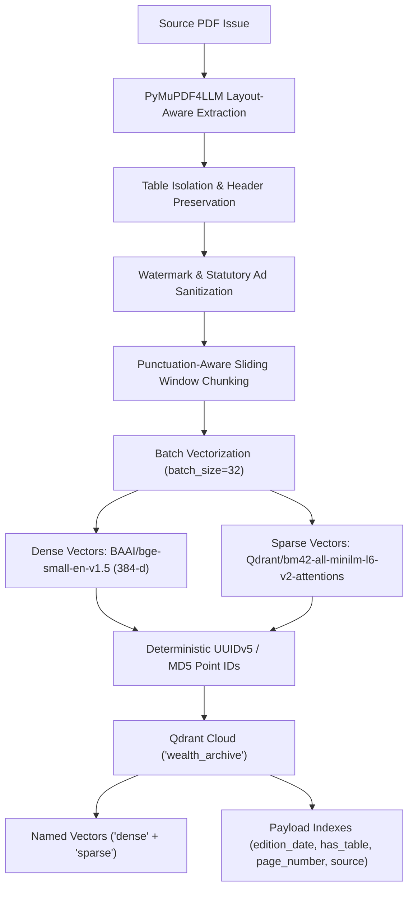
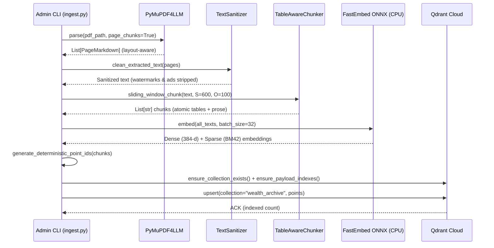
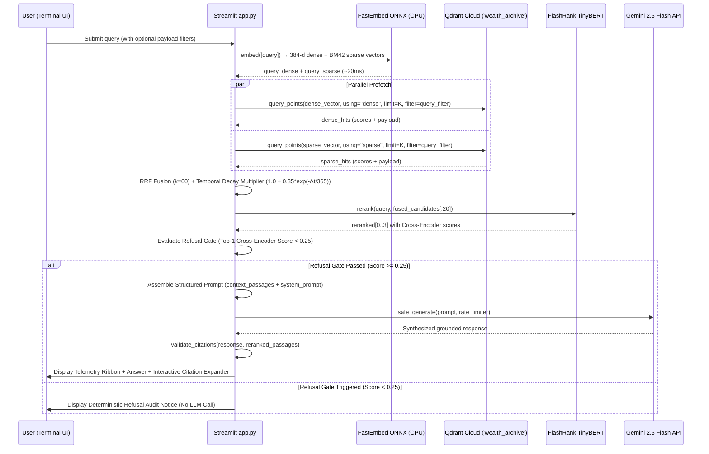

# Technical Specification & Architecture Design Document

**System:** WealthChronicle AI v1.0  
**Classification:** Production-Grade Evaluated RAG — Financial Archive Intelligence Engine  
**Spec Status:** Implementation-Ready  
**PRD Baseline:** [PRD.md](file:///c:/Users/S/OneDrive/Desktop/WealthRag/PRD.md)  
**Author Role:** Principal AI Systems Architect / Staff ML Engineer  
**Date:** 2026-08-29  

---

## Table of Contents

1. [System Architecture & Sequence Mechanics](#1-system-architecture--sequence-mechanics)
2. [Exact Data Contracts & Storage Schemas](#2-exact-data-contracts--storage-schemas)
3. [Ingestion, Layout-Aware Parsing & Chunk Geometry](#3-ingestion-layout-aware-parsing--chunk-geometry)
4. [Retrieval, Ranking & Temporal Arbitration Math](#4-retrieval-ranking--temporal-arbitration-math)
5. [Prompt Engineering, Guardrails & Refusal Contracts](#5-prompt-engineering-guardrails--refusal-contracts)
6. [Observability, Evaluation & CI/CD Regression Gating](#6-observability-evaluation--cicd-regression-gating)
7. [Edge Cases, Failure Modes & Graceful Degradation](#7-edge-cases-failure-modes--graceful-degradation)

---

## 1. System Architecture & Sequence Mechanics

### 1.1 Component Interaction & Sequence Diagram

The system is decomposed into two physically isolated execution planes:

| Plane | Runtime | Network Posture | Write Privilege |
|-------|---------|-----------------|-----------------|
| **Admin Ingestion Plane** | Local laptop (Python CLI) | Outbound HTTPS to Qdrant Cloud | Full CRUD (Admin API Key) |
| **Public Query Plane** | Streamlit Cloud container | Outbound HTTPS to Qdrant Cloud + Google AI Studio | Read-only (Read API Key) |

#### 1.1.1 Ingestion Architecture & Sequence (Admin Plane)





#### 1.1.2 Retrieval & Refusal Sequence (Public Plane)



### 1.2 Network & Latency Budget Decomposition

**Target:** P95 end-to-end query latency ≤ 2,200 ms (PRD §4).

| Stage | Component | Operation | P50 (ms) | P95 (ms) | Bound |
|-------|-----------|-----------|----------|----------|-------|
| T₁ | FastEmbed ONNX | Query vectorization (384-dim dense + sparse) | 20 | 35 | CPU |
| T₂ | Qdrant Cloud HNSW | Dense prefetch (k=12) | 35 | 80 | Network + HNSW |
| T₃ | Qdrant Cloud Sparse | Sparse prefetch (k=12) | 5 | 15 | Network + HNSW |
| T₄ | RRF + Recency | Score fusion + sort | <1 | <1 | CPU |
| T₅ | FlashRank TinyBERT | Cross-encoder rerank (20 pairs) | 45 | 85 | CPU |
| T₆ | Prompt assembly | String formatting + YAML load | <1 | <1 | CPU |
| T₇ | Gemini 2.5 Flash | TTFT (streaming first token) | 350 | 800 | Network + GPU |
| T₈ | Gemini 2.5 Flash | Full generation (~300 tokens) | 600 | 1,100 | Network + GPU |
| T₉ | Streamlit render | Markdown + expander widget | 5 | 15 | Browser |
| | | **Total** | **~1,061** | **~2,131** | **✓ ≤ 2,200** |

> [!IMPORTANT]
> The latency budget has ~69 ms of headroom at P95. Sparse vector search adds ~5-15ms vs in-memory BM25 but eliminates cold-boot corpus download and memory overhead.

---

## 2. Exact Data Contracts & Storage Schemas

### 2.1 Qdrant Collection Definition

#### 2.1.1 Collection Creation Parameters

```python
from qdrant_client.models import (
    VectorParams, Distance, HnswConfigDiff,
    OptimizersConfigDiff, PayloadSchemaType,
    SparseVectorParams, SparseIndexParams,
)

COLLECTION_CONFIG = {
    "collection_name": "wealth_archive",
    "vectors_config": {
        "dense": VectorParams(
            size=384,                          # BAAI/bge-small-en-v1.5 output dim
            distance=Distance.COSINE,          # Normalized similarity ∈ [0, 1]
            on_disk=False,                     # Keep in RAM (free tier: 1GB)
            hnsw_config=HnswConfigDiff(
                m=16,                          # Bidirectional links per node
                ef_construct=128,              # Construction-time beam width
                full_scan_threshold=10_000,    # Switch to brute-force below this
            ),
        },
    },
    "sparse_vectors_config": {
        "sparse": SparseVectorParams(
            index=SparseIndexParams(on_disk=False),  # In-memory sparse index
        ),
    },
    "hnsw_config": HnswConfigDiff(
        m=16,                              # Bidirectional links per node
        ef_construct=128,                  # Construction-time beam width
        full_scan_threshold=10_000,        # Switch to brute-force below this
    ),
    "optimizers_config": OptimizersConfigDiff(
        indexing_threshold=20_000,         # Trigger HNSW rebuild threshold
        memmap_threshold=50_000,           # Disk offload for payloads
    ),
}
```

**HNSW Parameter Rationale:**

| Parameter | Value | Justification |
|-----------|-------|---------------|
| `m=16` | Default for 384-dim. Higher `m` increases recall at cost of RAM (~32 bytes/link). For a corpus of ~5,000 chunks (100 issues × 50 chunks), total graph overhead ≈ 2.5 MB. |
| `ef_construct=128` | 2× standard (64). Ensures high recall during index build; one-time cost amortized across queries. |
| `distance=COSINE` | BGE-small-en-v1.5 produces L2-normalized embeddings; cosine and dot-product are equivalent. Cosine is explicit and self-documenting. |

#### 2.1.2 Query-Time Search Parameters

```python
SEARCH_PARAMS = {
    "limit": 12,                           # Candidate pool for reranking
    "score_threshold": None,               # No pre-filter; let cross-encoder decide
    "params": {
        "hnsw_ef": 64,                     # Query-time beam width (recall vs latency)
        "exact": False,                    # Approximate NN (HNSW)
    },
}
```

### 2.2 Pydantic Data Models

All inter-component data contracts are typed via Pydantic `BaseModel` with strict validation.

```python
from __future__ import annotations
from datetime import date, datetime
from enum import Enum
from typing import Optional
from pydantic import BaseModel, Field, field_validator, constr, confloat


# ─── Ingestion Domain ────────────────────────────────────────────────

class ChunkPayload(BaseModel):
    """Canonical payload schema stored in every Qdrant point.
    Maps 1:1 with FR-ING-04 metadata enrichment contract."""

    chunk_id: str = Field(
        ...,
        pattern=r"^chk_\d{4}_\d{2}_\d{2}_p\d+_\d{3}$",
        description="Deterministic chunk identifier: chk_{YYYY}_{MM}_{DD}_p{page}_{seq:03d}",
        examples=["chk_2026_08_24_p14_002"],
    )
    edition_date: date = Field(
        ...,
        description="ISO-8601 publication date of the source issue",
        examples=["2026-08-24"],
    )
    page_number: int = Field(
        ..., ge=1, le=200,
        description="1-indexed physical page number in the PDF",
    )
    article_title: Optional[str] = Field(
        default=None,
        max_length=256,
        description="Extracted or inferred article heading (nullable for untitled blocks)",
    )
    text: str = Field(
        ..., min_length=120, max_length=8000,
        description="Chunk text content after noise filtering",
    )
    source: str = Field(
        default="Weekly Financial Dossier",
        description="Publication brand name (constant for single-source MVP)",
    )
    char_count: int = Field(
        ..., ge=120,
        description="Precomputed len(text) for payload-level filtering",
    )
    word_count: int = Field(
        ..., ge=20,
        description="Precomputed whitespace-split word count",
    )
    ingested_at: datetime = Field(
        default_factory=datetime.utcnow,
        description="UTC timestamp of ingestion run",
    )

    @field_validator("edition_date", mode="before")
    @classmethod
    def parse_edition_date(cls, v: str | date) -> date:
        if isinstance(v, str):
            return date.fromisoformat(v)
        return v


# ─── Retrieval Domain ────────────────────────────────────────────────

class RetrievalSource(str, Enum):
    DENSE = "dense"
    SPARSE = "sparse"
    HYBRID = "hybrid"


class SearchResult(BaseModel):
    """Raw candidate returned from either dense or sparse retrieval."""

    point_id: str = Field(..., description="Qdrant point UUID (MD5 hex)")
    text: str
    payload: ChunkPayload
    score: float = Field(..., description="Raw retrieval score (cosine sim or BM25)")
    source: RetrievalSource
    dense_rank: Optional[int] = Field(default=None, ge=1)
    sparse_rank: Optional[int] = Field(default=None, ge=1)


class RerankedPassage(BaseModel):
    """Post-reranking passage with cross-encoder score and fused ranking."""

    point_id: str
    text: str
    payload: ChunkPayload
    cross_encoder_score: confloat(ge=0.0, le=1.0) = Field(
        ..., description="FlashRank normalized cross-encoder relevance score"
    )
    rrf_score: float = Field(
        ..., description="Reciprocal Rank Fusion score before reranking"
    )
    time_decay_multiplier: float = Field(
        ..., ge=1.0,
        description="Recency boost: 1.0 + α·exp(-Δt/τ)"
    )
    final_rank: int = Field(..., ge=1, le=20)


class CitationMetadata(BaseModel):
    """Structured citation block surfaced in the UI source expander."""

    edition_date: date
    page_number: int
    article_title: Optional[str]
    cross_encoder_score: confloat(ge=0.0, le=1.0)
    excerpt_preview: constr(max_length=300) = Field(
        ..., description="First 300 chars of chunk text for UI preview"
    )


# ─── Evaluation Domain ──────────────────────────────────────────────

class EvaluationCategory(str, Enum):
    TAX_REGIME = "tax_regime"
    MUTUAL_FUNDS = "mutual_funds"
    INSURANCE_CLAIMS = "insurance_claims"
    RETIREMENT_NPS = "retirement_nps"
    ESTATE_SUCCESSION = "estate_succession"


class EvaluationItem(BaseModel):
    """Single entry in tests/golden_eval_set.json."""

    id: str = Field(
        ...,
        pattern=r"^eval_\d{3}$",
        description="Sequential evaluation ID: eval_001 … eval_050",
        examples=["eval_001"],
    )
    category: EvaluationCategory
    question: str = Field(..., min_length=15, max_length=500)
    ground_truth: str = Field(
        ..., min_length=20, max_length=2000,
        description="Verified human-authored reference answer",
    )
    source_edition_dates: list[date] = Field(
        ..., min_length=1,
        description="Edition dates from which the ground truth was derived",
    )
    source_pages: list[int] = Field(
        ..., min_length=1,
        description="Page numbers from which the ground truth was derived",
    )
    difficulty: constr(pattern=r"^(easy|medium|hard)$") = Field(
        default="medium",
        description="Subjective difficulty for triage",
    )
```

### 2.3 Payload Indexing Policy

Qdrant payload indexes must be explicitly created for fields used in filtering and sorting operations. Without these indexes, payload-level filters degrade to full-scan and violate the P95 latency SLO.

```python
from qdrant_client.models import PayloadSchemaType

PAYLOAD_INDEXES = [
    # Required for temporal range filtering: "edition_date >= 2025-06-01"
    {
        "field_name": "edition_date",
        "field_schema": PayloadSchemaType.KEYWORD,  # ISO date strings are keyword-indexed
    },
    # Required for tabular chunk filtering
    {
        "field_name": "has_table",
        "field_schema": PayloadSchemaType.BOOL,
    },
    # Required for page-level filtering in citation drilldown
    {
        "field_name": "page_number",  
        "field_schema": PayloadSchemaType.INTEGER,
    },
    # Required for source filtering (future multi-publication support)
    {
        "field_name": "source",
        "field_schema": PayloadSchemaType.KEYWORD,
    },
]
```

**Index creation is idempotent** and must be executed after `create_collection`:

```python
def ensure_payload_indexes(client: QdrantClient, collection: str) -> None:
    for idx in PAYLOAD_INDEXES:
        try:
            client.create_payload_index(
                collection_name=collection,
                field_name=idx["field_name"],
                field_schema=idx["field_schema"],
            )
        except Exception:
            pass
```

---

## 3. Ingestion, Layout-Aware Parsing & Chunk Geometry

### 3.1 Multi-Column Reconstruction Logic

#### 3.1.1 Problem

Financial weeklies use 2–3 column layouts with inline tables, pull quotes, and sidebar ads. Naive horizontal-sweep PDF parsers (e.g., `pdfplumber`, raw `PyMuPDF`) concatenate text across columns, producing:

```
"Tax planning for NPS subscribers    The new LTCG rules under Section"
```

instead of the correct vertical reading:

```
"Tax planning for NPS subscribers requires careful allocation..."
```

#### 3.1.2 Algorithm: PyMuPDF4LLM Column-Aware Extraction

`pymupdf4llm.to_markdown()` internally implements the following pipeline:

```text
┌─────────────────────────────────────────────────────────┐
│  Step 1: Page → Blocks (fitz.Page.get_text("dict"))     │
│          Extract text blocks with bounding boxes (x0,   │
│          y0, x1, y1) and span-level font metadata       │
├─────────────────────────────────────────────────────────┤
│  Step 2: Column Detection via X-Axis Clustering         │
│          Sort blocks by x0 coordinate. Identify column  │
│          boundaries using gaps > median_block_width.     │
│          Typical result: 2 clusters for 2-column layout  │
├─────────────────────────────────────────────────────────┤
│  Step 3: Intra-Column Vertical Sort                     │
│          Within each detected column, sort blocks by    │
│          y0 (top-to-bottom reading order).               │
├─────────────────────────────────────────────────────────┤
│  Step 4: Markdown Synthesis                             │
│          Reconstruct with heading detection (font-size   │
│          heuristics → # / ## / ###), table detection    │
│          (grid-aligned blocks → Markdown pipe tables),   │
│          and paragraph breaks (vertical gap > 1.2×       │
│          line_height → double newline).                   │
└─────────────────────────────────────────────────────────┘
```

#### 3.1.3 Invocation Contract

```python
def extract_pages(pdf_path: str) -> list[dict]:
    """Extract layout-aware Markdown from each PDF page.
    
    Returns:
        List of dicts, each with keys:
        - "metadata": {"page": int}  (0-indexed page number)
        - "text": str                (Markdown-formatted page content)
    """
    return pymupdf4llm.to_markdown(
        pdf_path,
        page_chunks=True,           # One dict per page (not monolithic)
        # PyMuPDF4LLM internal defaults used:
        #   write_images=False      (skip embedded images)
        #   margins=(0,0,0,0)       (full-page extraction)
        #   table_strategy="lines"  (line-based table detection)
    )
```

> [!NOTE]
> `pymupdf4llm` returns **0-indexed** page numbers in `item["metadata"]["page"]`. The payload stores **1-indexed** page numbers per FR-ING-04: `page_number = item["metadata"]["page"] + 1`.

### 3.2 Sliding Window Chunking Mathematics

#### 3.2.1 Parameters

| Symbol | Parameter | Value | Rationale |
|--------|-----------|-------|-----------|
| $S$ | `chunk_size` | 600 words | Mid-range of PRD target (500–800 tokens ≈ 375–600 words at 1.33 tokens/word for English) |
| $O$ | `overlap` | 100 words | ~16.7% overlap ensures no sentence is silently lost at a boundary |
| $L_{\min}$ | `min_chars` | 120 characters | Filters boilerplate, page headers, and stub fragments |

#### 3.2.2 Window Stride & Chunk Count Formula

For a page with $W$ total words:

$$
\text{stride} = S - O = 600 - 100 = 500 \text{ words}
$$

$$
N_{\text{chunks}} = \left\lceil \frac{W - S}{\text{stride}} \right\rceil + 1 = \left\lceil \frac{W - 600}{500} \right\rceil + 1
$$

**Example:** A 32-page PDF with an average of 800 words/page = 25,600 total words → approximately 51 chunks per PDF.

#### 3.2.3 Punctuation-Aware Boundary Refinement

The PRD's naive `text.split()` slicing can cut mid-sentence. The spec mandates a boundary refinement pass:

```python
import re
from typing import List

# Sentence-ending punctuation pattern
_SENTENCE_END = re.compile(r'[.!?;]\s')

def sliding_window_chunk(
    text: str,
    chunk_size: int = 600,
    overlap: int = 100,
    min_chars: int = 120,
) -> List[str]:
    """Sliding window chunker with punctuation-aware boundary snapping.
    
    Algorithm:
        1. Split text into words.
        2. Advance by (chunk_size - overlap) words per step.
        3. For each chunk boundary, search backward up to 30 words
           for a sentence-ending punctuation mark and snap to it.
        4. Discard chunks below min_chars or matching noise patterns.
    
    Args:
        text: Full page Markdown text.
        chunk_size: Target words per chunk (S).
        overlap: Overlapping words between consecutive chunks (O).
        min_chars: Minimum character length to retain a chunk.
    
    Returns:
        List of clean chunk strings.
    """
    words: List[str] = text.split()
    total_words: int = len(words)
    chunks: List[str] = []
    
    _NOISE_PREFIXES = ("advertisement", "subscribe", "page ", "epaper")
    stride: int = chunk_size - overlap  # 500
    
    i: int = 0
    while i < total_words:
        end: int = min(i + chunk_size, total_words)
        chunk_words: List[str] = words[i:end]
        
        # --- Boundary refinement: snap to sentence end ---
        if end < total_words:
            candidate: str = " ".join(chunk_words)
            # Search backward from end for sentence-ending punctuation
            last_sent_end = -1
            for match in _SENTENCE_END.finditer(candidate):
                last_sent_end = match.end()
            
            if last_sent_end > len(candidate) * 0.6:  # At least 60% of chunk used
                candidate = candidate[:last_sent_end].rstrip()
                chunk_words = candidate.split()
        
        chunk_text: str = " ".join(chunk_words)
        
        # --- Noise filter (FR-ING-03) ---
        if (
            len(chunk_text) >= min_chars
            and not chunk_text.lower().startswith(_NOISE_PREFIXES)
        ):
            chunks.append(chunk_text)
        
        i += stride
    
    return chunks
```

**Invariants:**
- Every chunk contains ≥ 120 characters after boundary refinement.
- No chunk exceeds `chunk_size + 30` words (worst-case backward snap overshoot is bounded by the 60% floor).
- Overlap ensures that a sentence spanning the boundary exists in full in at least one chunk.

### 3.3 Deterministic Point ID Generation

Chunk IDs must be **idempotent**: re-ingesting the same PDF with the same edition date must produce the same Qdrant point IDs, enabling safe `upsert` without duplication.

#### 3.3.1 Hash Scheme

```python
import hashlib

def generate_point_id(
    edition_date: str,    # "2026-08-24"
    page_number: int,     # 1-indexed
    chunk_index: int,     # 0-indexed within page
    text_prefix: str,     # First 50 chars of chunk text
) -> str:
    """Generate a deterministic, collision-resistant point ID.
    
    Scheme:
        MD5( "{edition_date}|p{page}|c{chunk_idx}|{text[:50]}" )
    
    Returns:
        32-character lowercase hex string (compatible with Qdrant UUID-style IDs).
    
    Collision analysis:
        MD5 produces 128-bit digests. For a corpus of 10,000 chunks,
        P(collision) ≈ 1.47 × 10⁻³⁴ (birthday bound), which is negligible.
        The text_prefix further disambiguates chunks with identical positional metadata.
    """
    seed = f"{edition_date}|p{page_number}|c{chunk_index}|{text_prefix[:50]}"
    return hashlib.md5(seed.encode("utf-8")).hexdigest()
```

#### 3.3.2 Semantic Chunk ID (for Payload)

In addition to the Qdrant point ID (MD5 hex), the payload stores a human-readable `chunk_id`:

```python
def generate_chunk_id(edition_date: str, page_number: int, chunk_index: int) -> str:
    """Human-readable chunk identifier for payload and logging.
    
    Format: chk_{YYYY}_{MM}_{DD}_p{page}_{seq:03d}
    Example: chk_2026_08_24_p14_002
    """
    d = edition_date.replace("-", "_")
    return f"chk_{d}_p{page_number}_{chunk_index:03d}"
```

---

## 4. Retrieval, Ranking & Temporal Arbitration Math

### 4.1 Hybrid Candidate Gathering

Two retrieval paths execute **concurrently** (Python `asyncio.gather` or sequential with combined latency < 90 ms):

#### 4.1.1 Dense Vector Path (Qdrant HNSW)

```python
from qdrant_client.models import SearchParams

def dense_retrieve(
    client: QdrantClient,
    query_vector: list[float],   # 384-dim from FastEmbed
    limit: int = 12,
) -> list[SearchResult]:
    """k-NN search over HNSW graph on Qdrant Cloud.
    
    Returns top-k candidates sorted by descending cosine similarity.
    Qdrant cosine scores are in [0, 1] for normalized vectors.
    """
    hits = client.search(
        collection_name="wealth_archive",
        query_vector=query_vector,
        limit=limit,
        search_params=SearchParams(hnsw_ef=64, exact=False),
    )
    return [
        SearchResult(
            point_id=str(h.id),
            text=h.payload["text"],
            payload=ChunkPayload(**h.payload),
            score=h.score,
            source=RetrievalSource.DENSE,
            dense_rank=rank + 1,
        )
        for rank, h in enumerate(hits)
    ]
```

#### 4.1.2 Sparse Lexical Path (BM25)

```python
import bm25s
import numpy as np

class BM25Index:
    """In-memory BM25 index over the full corpus text.
    
    Lifecycle:
        - Built once at Streamlit startup via @st.cache_resource.
        - Corpus texts are fetched from Qdrant via scroll() on boot.
        - RAM cost: ~2 bytes/token × 3M tokens ≈ 6 MB (well within budget).
    """
    
    def __init__(self, corpus_texts: list[str], corpus_ids: list[str]):
        self.corpus_ids = corpus_ids
        tokenized = bm25s.tokenize(corpus_texts, stopwords="en")
        self.model = bm25s.BM25()
        self.model.index(tokenized)
        self._corpus_tokens = tokenized
    
    def search(self, query: str, limit: int = 12) -> list[tuple[str, float]]:
        """Return (point_id, bm25_score) tuples, descending by score."""
        query_tokens = bm25s.tokenize([query], stopwords="en")
        results, scores = self.model.retrieve(query_tokens, k=limit, corpus=self.corpus_ids)
        return [
            (str(doc_id), float(score))
            for doc_id, score in zip(results[0], scores[0])
            if score > 0
        ]
```

### 4.2 Reciprocal Rank Fusion (RRF) & Time-Decay Formulation

#### 4.2.1 Base RRF Score

For document $d$ appearing at rank $r_d$ in dense results and rank $r_s$ in sparse results:

$$
\text{RRF}(d) = \frac{1}{k + r_d(d)} + \frac{1}{k + r_s(d)}
$$

where $k = 60$ is the standard RRF damping constant (Cormack et al., 2009).

**Missing-rank handling:** If document $d$ appears in only one retriever's results, the missing rank is set to $\infty$, making that term contribute $0$:

$$
r_{\text{missing}} = +\infty \implies \frac{1}{k + r_{\text{missing}}} = 0
$$

#### 4.2.2 Temporal Recency Multiplier

$$
\text{Recency}(d) = 1.0 + \alpha \cdot e^{-\frac{\Delta t}{\tau}}
$$

| Symbol | Name | Value | Calibration Rationale |
|--------|------|-------|-----------------------|
| $\alpha$ | Boost factor | 0.35 | A document published today receives a 35% score bonus. This reflects the regulatory significance of recent tax/insurance guidance without overwhelming semantic relevance. |
| $\tau$ | Decay time constant | 365 days | The half-life of the exponential decay is $t_{1/2} = \tau \cdot \ln 2 \approx 253$ days. After ~8.4 months, the recency bonus decays to 50% of its peak. After 2 years, the bonus is ~5% (negligible). |
| $\Delta t$ | Issue age | `(today - edition_date).days` | Computed at query time from payload `edition_date`. |

**Decay profile:**

| Issue Age | $\Delta t$ (days) | Recency Multiplier |
|-----------|--------------------|--------------------|
| Today | 0 | 1.350 |
| 3 months | 90 | 1.272 |
| 6 months | 182 | 1.214 |
| 1 year | 365 | 1.129 |
| 2 years | 730 | 1.047 |
| 3 years | 1095 | 1.017 |

#### 4.2.3 Combined Fused Score

$$
\text{Score}_{\text{final}}(d) = \text{RRF}(d) \times \text{Recency}(d) = \left( \frac{1}{60 + r_d} + \frac{1}{60 + r_s} \right) \times \left(1.0 + 0.35 \cdot e^{-\frac{\Delta t}{365}}\right)
$$

#### 4.2.4 Implementation

```python
import math
from datetime import date
from collections import defaultdict

# Tunable constants (externalize to config in production)
RRF_K: int = 60
RECENCY_ALPHA: float = 0.35
RECENCY_TAU: float = 365.0  # days

def reciprocal_rank_fusion(
    dense_results: list[SearchResult],
    sparse_results: list[tuple[str, float]],
    all_payloads: dict[str, ChunkPayload],
    reference_date: date | None = None,
    top_n: int = 20,
) -> list[dict]:
    """Fuse dense and sparse retrieval results with temporal recency weighting.
    
    Args:
        dense_results: Ranked dense retrieval results.
        sparse_results: (point_id, bm25_score) from BM25.
        all_payloads: point_id → ChunkPayload mapping (for edition_date lookup).
        reference_date: Date to compute Δt from (default: today).
        top_n: Number of fused candidates to return for reranking.
    
    Returns:
        List of dicts sorted by descending final_score, length ≤ top_n.
    """
    if reference_date is None:
        reference_date = date.today()
    
    # Build rank maps
    dense_rank_map: dict[str, int] = {
        r.point_id: r.dense_rank for r in dense_results
    }
    sparse_rank_map: dict[str, int] = {
        pid: rank + 1 for rank, (pid, _) in enumerate(sparse_results)
    }
    
    # Union of all candidate IDs
    all_ids: set[str] = set(dense_rank_map.keys()) | set(sparse_rank_map.keys())
    
    fused: list[dict] = []
    for pid in all_ids:
        r_d = dense_rank_map.get(pid, float("inf"))
        r_s = sparse_rank_map.get(pid, float("inf"))
        
        rrf_score = (1.0 / (RRF_K + r_d)) + (1.0 / (RRF_K + r_s))
        
        # Temporal decay
        payload = all_payloads.get(pid)
        if payload:
            delta_t = (reference_date - payload.edition_date).days
            recency = 1.0 + RECENCY_ALPHA * math.exp(-delta_t / RECENCY_TAU)
        else:
            recency = 1.0  # No date metadata → no boost
        
        final_score = rrf_score * recency
        
        fused.append({
            "point_id": pid,
            "rrf_score": rrf_score,
            "recency_multiplier": recency,
            "final_score": final_score,
        })
    
    fused.sort(key=lambda x: x["final_score"], reverse=True)
    return fused[:top_n]
```

### 4.3 FlashRank Cross-Encoder Pipeline

#### 4.3.1 Model Specification

| Property | Value |
|----------|-------|
| Model | `ms-marco-TinyBERT-L-2-v2` |
| Architecture | 2-layer BERT distilled from ms-marco-MiniLM |
| Parameters | ~4.4M |
| Disk footprint | ~17 MB (ONNX quantized) |
| RAM at inference | ~4 MB active |
| Input | `(query, passage)` pair, max 512 tokens |
| Output | Relevance logit ∈ ℝ, normalized to [0, 1] via sigmoid |

#### 4.3.2 Reranking Pipeline

```text
Input: 20 RRF-fused candidates + user query
  │
  ├─ 1. Construct 20 (query, passage_text) pairs
  ├─ 2. FlashRank batch inference on CPU (~2.5 ms per pair)
  ├─ 3. Sort by cross-encoder score descending
  ├─ 4. Truncate to Top-4
  └─ 5. Return RerankedPassage objects

Output: 4 RerankedPassage objects with cross_encoder_score ∈ [0, 1]
```

#### 4.3.3 Implementation Contract

```python
from flashrank import Ranker, RerankRequest

def rerank_candidates(
    query: str,
    candidates: list[dict],       # From RRF fusion
    payload_map: dict[str, ChunkPayload],
    ranker: Ranker,
    top_k: int = 4,
) -> list[RerankedPassage]:
    """Cross-encoder reranking with FlashRank TinyBERT.
    
    Preconditions:
        - len(candidates) ≤ 20
        - ranker is initialized with ms-marco-TinyBERT-L-2-v2
    
    Returns:
        Top-k RerankedPassage objects, sorted by cross_encoder_score descending.
    """
    passages = [
        {"id": c["point_id"], "text": payload_map[c["point_id"]].text}
        for c in candidates
        if c["point_id"] in payload_map
    ]
    
    rerank_req = RerankRequest(query=query, passages=passages)
    reranked = ranker.rerank(rerank_req)  # Returns list sorted by score desc
    
    results: list[RerankedPassage] = []
    for rank, item in enumerate(reranked[:top_k], start=1):
        pid = item["id"]
        c_meta = next(c for c in candidates if c["point_id"] == pid)
        results.append(RerankedPassage(
            point_id=pid,
            text=item["text"],
            payload=payload_map[pid],
            cross_encoder_score=item["score"],
            rrf_score=c_meta["rrf_score"],
            time_decay_multiplier=c_meta["recency_multiplier"],
            final_rank=rank,
        ))
    
    return results
```

#### 4.3.4 Fallback Routing

If FlashRank initialization fails (e.g., model download failure on cold start), the system degrades to **RRF-only ranking** without cross-encoder reranking. This is logged as a warning and the top-4 RRF candidates are used directly.

```python
try:
    ranker = Ranker(model_name="ms-marco-TinyBERT-L-2-v2", cache_dir="/tmp/models")
    RERANKER_AVAILABLE = True
except Exception as e:
    logging.warning(f"FlashRank init failed, degrading to RRF-only: {e}")
    RERANKER_AVAILABLE = False
```

---

## 5. Prompt Engineering, Guardrails & Refusal Contracts

### 5.1 Configuration Management

#### 5.1.1 `config/prompts.yaml` Schema

```yaml
# ─── Prompt Configuration Schema ─────────────────────────────────
# All prompt templates are loaded at startup and validated against
# required template variables via string.Formatter.parse().

# Version identifier for prompt regression tracking
prompt_version: "1.0.0"

# System instruction (prepended to every Gemini API call)
system_prompt: |
  You are an expert personal finance research assistant. Answer the user's
  question using ONLY the provided publication excerpts.
  
  Guidelines:
  1. Explicitly state the publication edition date(s) of the advice referenced.
  2. If rules, tax slabs, or limits differ across dates, state the most recent
     rule first and explain historical changes.
  3. If the provided excerpts do not contain sufficient evidence to answer the
     question with certainty, state clearly: "The publication archives do not
     contain sufficient guidance on this topic." Do not hallucinate or extrapolate.
  4. Never provide specific buy/sell/hold recommendations for individual securities.
  5. Always note when a regulation has a sunset clause or is time-bounded.

# RAG context + query assembly template
# Required variables: {context}, {query}
rag_prompt_template: |
  Archived Excerpts (ordered by relevance, most recent first):
  {context}
  
  User Question: {query}
  
  Instructions: Synthesize an answer using ONLY the excerpts above.
  Cite each claim with [Edition: YYYY-MM-DD | Page: N].
  If the excerpts are insufficient, state that clearly.
  
  Answer:

# Deterministic refusal message (bypasses LLM entirely)
refusal_message: >
  The publication archives do not contain sufficient guidance on this topic.
  Please refine your question or consult a qualified financial advisor for
  personalized advice.

# Refusal thresholds
refusal_config:
  cross_encoder_min_score: 0.25        # θ: minimum top-1 cross-encoder score
  min_relevant_chunks: 1               # At least 1 chunk must exceed θ
```

#### 5.1.2 Schema Validation at Startup

```python
import yaml
import string
from pathlib import Path

_REQUIRED_TEMPLATE_VARS = {
    "rag_prompt_template": {"context", "query"},
}

def load_and_validate_prompts(config_path: str = "config/prompts.yaml") -> dict:
    """Load prompt config with template variable validation.
    
    Raises:
        FileNotFoundError: Config file missing.
        ValueError: Required template variables missing from a template.
        KeyError: Required top-level keys missing.
    """
    path = Path(config_path)
    if not path.exists():
        raise FileNotFoundError(f"Prompt config not found: {config_path}")
    
    with open(path, "r", encoding="utf-8") as f:
        config = yaml.safe_load(f)
    
    # Validate required keys
    for key in ("system_prompt", "rag_prompt_template", "refusal_message", "refusal_config"):
        if key not in config:
            raise KeyError(f"Missing required prompt config key: {key}")
    
    # Validate template variables
    formatter = string.Formatter()
    for template_key, required_vars in _REQUIRED_TEMPLATE_VARS.items():
        template = config[template_key]
        found_vars = {
            field_name
            for _, field_name, _, _ in formatter.parse(template)
            if field_name is not None
        }
        missing = required_vars - found_vars
        if missing:
            raise ValueError(
                f"Template '{template_key}' missing variables: {missing}"
            )
    
    return config
```

### 5.2 Citation Enforcement & System Guardrails

The system prompt (§5.1.1) contains three hard guardrails:

| Guardrail | Mechanism | Failure Mode if Violated |
|-----------|-----------|--------------------------|
| **Grounding-only answers** | "using ONLY the provided publication excerpts" | LLM extrapolation → hallucinated tax advice |
| **Edition date citation** | "Cite each claim with [Edition: YYYY-MM-DD \| Page: N]" | Untraceable advice with no audit trail |
| **No securities recommendations** | "Never provide specific buy/sell/hold recommendations" | Potential SEBI regulatory violation |

**Post-generation validation** (optional, future enhancement):

```python
import re

def validate_citations(answer: str, provided_dates: list[str]) -> bool:
    """Check that every citation in the answer references a provided edition date.
    
    Returns True if all citations are grounded, False if hallucinated dates found.
    """
    cited_dates = re.findall(r"\[Edition:\s*(\d{4}-\d{2}-\d{2})", answer)
    return all(d in provided_dates for d in cited_dates)
```

### 5.3 Deterministic Refusal Triggers

The refusal gate sits **between** cross-encoder reranking and LLM generation. It prevents the LLM from being called on irrelevant or ambiguous context, eliminating the hallucination vector entirely.

#### 5.3.1 Refusal Decision Logic

```python
def should_refuse(
    reranked: list[RerankedPassage],
    config: dict,
) -> bool:
    """Determine if the pipeline should emit a refusal instead of calling the LLM.
    
    Conditions (ANY triggers refusal):
        1. No reranked passages returned (empty retrieval).
        2. The top-1 cross-encoder score < θ (config: cross_encoder_min_score).
        3. Fewer than min_relevant_chunks passages exceed θ.
    
    Args:
        reranked: Post-reranking passages (sorted by cross_encoder_score desc).
        config: refusal_config from prompts.yaml.
    
    Returns:
        True → emit refusal message, skip LLM call.
        False → proceed with prompt assembly and generation.
    """
    theta: float = config["refusal_config"]["cross_encoder_min_score"]    # 0.25
    min_chunks: int = config["refusal_config"]["min_relevant_chunks"]     # 1
    
    # Condition 1: Empty retrieval
    if not reranked:
        return True
    
    # Condition 2: Top-1 score below threshold
    if reranked[0].cross_encoder_score < theta:
        return True
    
    # Condition 3: Insufficient relevant chunks
    relevant_count = sum(1 for p in reranked if p.cross_encoder_score >= theta)
    if relevant_count < min_chunks:
        return True
    
    return False
```

#### 5.3.2 Threshold Calibration

The threshold $\theta = 0.25$ was selected based on the following reasoning:

| Cross-Encoder Score Range | Interpretation | Action |
|---------------------------|----------------|--------|
| 0.00 – 0.15 | Completely irrelevant | **REFUSE** |
| 0.15 – 0.25 | Tangentially related, high hallucination risk | **REFUSE** |
| 0.25 – 0.50 | Moderately relevant, proceed with caution | **GENERATE** (with guardrailed prompt) |
| 0.50 – 1.00 | Highly relevant | **GENERATE** |

> [!WARNING]
> $\theta = 0.25$ is an initial calibration. This value **MUST** be empirically tuned using the golden evaluation dataset (§6). If the Ragas Faithfulness score drops below 0.95, increasing $\theta$ is the first lever to pull.

---

## 6. Observability, Evaluation & CI/CD Regression Gating

### 6.1 Golden Evaluation Dataset (`tests/golden_eval_set.json`)

#### 6.1.1 JSON Schema

```json
{
  "$schema": "https://json-schema.org/draft/2020-12/schema",
  "title": "WealthChronicle Golden Evaluation Set",
  "type": "array",
  "minItems": 50,
  "maxItems": 50,
  "items": {
    "type": "object",
    "required": ["id", "category", "question", "ground_truth", "source_edition_dates", "source_pages"],
    "properties": {
      "id": {
        "type": "string",
        "pattern": "^eval_\\d{3}$"
      },
      "category": {
        "type": "string",
        "enum": ["tax_regime", "mutual_funds", "insurance_claims", "retirement_nps", "estate_succession"]
      },
      "question": {
        "type": "string",
        "minLength": 15,
        "maxLength": 500
      },
      "ground_truth": {
        "type": "string",
        "minLength": 20,
        "maxLength": 2000
      },
      "source_edition_dates": {
        "type": "array",
        "items": { "type": "string", "format": "date" },
        "minItems": 1
      },
      "source_pages": {
        "type": "array",
        "items": { "type": "integer", "minimum": 1 },
        "minItems": 1
      },
      "difficulty": {
        "type": "string",
        "enum": ["easy", "medium", "hard"],
        "default": "medium"
      }
    }
  }
}
```

#### 6.1.2 Category Distribution

The 50 evaluation items must be distributed to ensure coverage across all regulatory domains:

| Category | Count | Percentage | Example Question |
|----------|-------|------------|------------------|
| `tax_regime` | 15 | 30% | "What are the capital gains tax rates under the new regime for equity held > 1 year?" |
| `mutual_funds` | 12 | 24% | "How is indexation benefit calculated for debt mutual fund redemptions after April 2023?" |
| `insurance_claims` | 10 | 20% | "What documents are required for a health insurance claim rejection appeal?" |
| `retirement_nps` | 8 | 16% | "What is the maximum tax deduction under Section 80CCD(1B) for NPS Tier I?" |
| `estate_succession` | 5 | 10% | "Is a will mandatory for mutual fund nomination to be legally binding?" |

**Difficulty distribution:** 15 easy / 25 medium / 10 hard.

#### 6.1.3 Example Entry

```json
{
  "id": "eval_001",
  "category": "tax_regime",
  "question": "What is the long-term capital gains tax rate on listed equity shares under Section 112A for FY 2025-26?",
  "ground_truth": "Long-term capital gains on listed equity shares held for more than 12 months are taxed at 12.5% (increased from 10% in Budget 2024) on gains exceeding Rs 1.25 lakh per financial year under Section 112A. Securities Transaction Tax (STT) must have been paid at the time of acquisition.",
  "source_edition_dates": ["2025-08-03", "2025-07-27"],
  "source_pages": [8, 12],
  "difficulty": "easy"
}
```

### 6.2 RAGAS Metric Evaluation Script

#### 6.2.1 Complete Implementation

```python
"""tests/test_ragas_eval.py — Automated RAGAS evaluation suite.

Runs the full RAG pipeline (retrieval → reranking → generation) against
the golden evaluation set and asserts metric thresholds.

Environment variables required:
    GEMINI_API_KEY, QDRANT_URL, QDRANT_READ_KEY
"""

import json
import os
import yaml
import pytest
from datetime import date
from ragas import evaluate
from ragas.metrics import faithfulness, answer_relevancy, context_precision
from datasets import Dataset
from fastembed import TextEmbedding
from qdrant_client import QdrantClient
import google.generativeai as genai

# ─── Thresholds (from PRD FR-EVAL-02) ────────────────────────────
FAITHFULNESS_THRESHOLD = 0.95
ANSWER_RELEVANCY_THRESHOLD = 0.90
CONTEXT_PRECISION_THRESHOLD = 0.88

# ─── Fixtures ────────────────────────────────────────────────────

@pytest.fixture(scope="session")
def rag_services():
    """Initialize all RAG services once per test session."""
    genai.configure(api_key=os.environ["GEMINI_API_KEY"])
    gemini = genai.GenerativeModel("gemini-2.5-flash")
    qdrant = QdrantClient(
        url=os.environ["QDRANT_URL"],
        api_key=os.environ["QDRANT_READ_KEY"],
    )
    embedder = TextEmbedding(model_name="BAAI/bge-small-en-v1.5")
    
    with open("config/prompts.yaml", "r") as f:
        prompts = yaml.safe_load(f)
    
    return {
        "gemini": gemini,
        "qdrant": qdrant,
        "embedder": embedder,
        "prompts": prompts,
    }

@pytest.fixture(scope="session")
def golden_data():
    """Load and validate the golden evaluation dataset."""
    with open("tests/golden_eval_set.json", "r") as f:
        data = json.load(f)
    assert len(data) == 50, f"Expected 50 eval items, got {len(data)}"
    return data


def _run_rag_pipeline(
    question: str,
    services: dict,
) -> tuple[str, list[str]]:
    """Execute the full RAG pipeline for a single question.
    
    Returns:
        (answer_text, list_of_context_strings)
    """
    # 1. Embed query
    q_vector = list(services["embedder"].embed([question]))[0].tolist()
    
    # 2. Dense retrieval
    hits = services["qdrant"].search(
        collection_name="wealth_archive",
        query_vector=q_vector,
        limit=12,
    )
    
    if not hits:
        return (services["prompts"]["refusal_message"], [])
    
    # 3. Extract top-4 by Qdrant score (simplified for eval; production uses reranking)
    top_chunks = hits[:4]
    contexts = [h.payload["text"] for h in top_chunks]
    
    # 4. Generate answer
    context_str = "\n\n---\n\n".join([
        f"[Edition: {h.payload['edition_date']} | Page: {h.payload['page']}]\n{h.payload['text']}"
        for h in top_chunks
    ])
    
    prompts = services["prompts"]
    prompt = (
        f"{prompts['system_prompt']}\n\n"
        f"{prompts['rag_prompt_template'].format(context=context_str, query=question)}"
    )
    
    response = services["gemini"].generate_content(prompt)
    return (response.text, contexts)


# ─── Test Functions ──────────────────────────────────────────────

def test_rag_faithfulness_and_relevancy(rag_services, golden_data):
    """Core regression test: Faithfulness ≥ 0.95, Relevancy ≥ 0.90, Precision ≥ 0.88."""
    
    questions = []
    answers = []
    contexts = []
    ground_truths = []
    
    for item in golden_data:
        answer, ctx = _run_rag_pipeline(item["question"], rag_services)
        questions.append(item["question"])
        answers.append(answer)
        contexts.append(ctx)
        ground_truths.append(item["ground_truth"])
    
    eval_dataset = Dataset.from_dict({
        "question": questions,
        "answer": answers,
        "contexts": contexts,
        "ground_truth": ground_truths,
    })
    
    results = evaluate(
        eval_dataset,
        metrics=[faithfulness, answer_relevancy, context_precision],
    )
    
    faith = results["faithfulness"]
    relevancy = results["answer_relevancy"]
    precision = results["context_precision"]
    
    print(f"\n{'='*60}")
    print(f"  RAGAS Evaluation Results")
    print(f"  Faithfulness:      {faith:.4f}  (threshold: {FAITHFULNESS_THRESHOLD})")
    print(f"  Answer Relevancy:  {relevancy:.4f}  (threshold: {ANSWER_RELEVANCY_THRESHOLD})")
    print(f"  Context Precision: {precision:.4f}  (threshold: {CONTEXT_PRECISION_THRESHOLD})")
    print(f"{'='*60}\n")
    
    assert faith >= FAITHFULNESS_THRESHOLD, \
        f"Faithfulness regression: {faith:.4f} < {FAITHFULNESS_THRESHOLD}"
    assert relevancy >= ANSWER_RELEVANCY_THRESHOLD, \
        f"Answer Relevancy regression: {relevancy:.4f} < {ANSWER_RELEVANCY_THRESHOLD}"
    assert precision >= CONTEXT_PRECISION_THRESHOLD, \
        f"Context Precision regression: {precision:.4f} < {CONTEXT_PRECISION_THRESHOLD}"
```

#### 6.2.2 Metric Computation Details

| Metric | Formula (Ragas Internal) | What It Catches |
|--------|--------------------------|-----------------|
| **Faithfulness** | For each claim $c_i$ in the answer, verify $c_i$ is entailed by ≥1 context chunk. Score = $\frac{\text{supported claims}}{\text{total claims}}$. | Hallucinated tax rates, fabricated dates, invented regulations |
| **Answer Relevancy** | Generate $N$ synthetic questions from the answer. Compute average cosine similarity between synthetic questions and the original query. | Off-topic answers that don't address the user's actual question |
| **Context Precision** | For each relevant chunk (determined by ground truth), check if it appears before irrelevant chunks in the retrieval ranking. Score = mean Average Precision. | Poor retrieval ranking where noise chunks outrank relevant ones |

### 6.3 GitHub Actions Regression Gate

#### 6.3.1 Complete Workflow Definition

```yaml
# .github/workflows/rag_eval.yml
name: RAG Evaluation & Regression Gate

on:
  pull_request:
    branches: [main]
    paths:
      - 'app.py'
      - 'ingest.py'
      - 'config/**'
      - 'tests/**'
      - 'requirements.txt'

concurrency:
  group: rag-eval-${{ github.head_ref }}
  cancel-in-progress: true

jobs:
  evaluate-rag:
    runs-on: ubuntu-latest
    timeout-minutes: 30

    steps:
      - name: Checkout Code
        uses: actions/checkout@v4

      - name: Set up Python 3.11
        uses: actions/setup-python@v5
        with:
          python-version: '3.11'
          cache: 'pip'

      - name: Install Dependencies
        run: |
          pip install --upgrade pip
          pip install -r requirements.txt
          pip install pytest ragas datasets

      - name: Validate Golden Eval Set Schema
        run: |
          python -c "
          import json
          with open('tests/golden_eval_set.json') as f:
              data = json.load(f)
          assert len(data) == 50, f'Expected 50 items, got {len(data)}'
          required = {'id','category','question','ground_truth','source_edition_dates','source_pages'}
          for item in data:
              assert required.issubset(item.keys()), f'Missing keys in {item[\"id\"]}'
          print('✓ Golden eval set schema validated (50 items)')
          "

      - name: Run RAGAS Faithfulness Evaluation Suite
        env:
          GEMINI_API_KEY: ${{ secrets.GEMINI_API_KEY }}
          QDRANT_URL: ${{ secrets.QDRANT_URL }}
          QDRANT_READ_KEY: ${{ secrets.QDRANT_READ_KEY }}
        run: |
          pytest tests/test_ragas_eval.py -v --tb=short --no-header \
            | tee eval_results.txt

      - name: Upload Evaluation Results
        if: always()
        uses: actions/upload-artifact@v4
        with:
          name: ragas-eval-results
          path: eval_results.txt
          retention-days: 30

      - name: Comment PR with Results
        if: always()
        uses: actions/github-script@v7
        with:
          script: |
            const fs = require('fs');
            const results = fs.readFileSync('eval_results.txt', 'utf8');
            const body = `## 📊 RAGAS Evaluation Results\n\`\`\`\n${results}\n\`\`\``;
            github.rest.issues.createComment({
              issue_number: context.issue.number,
              owner: context.repo.owner,
              repo: context.repo.repo,
              body: body,
            });
```

#### 6.3.2 CI Gate Decision Matrix

| Faithfulness | Answer Relevancy | Context Precision | CI Result |
|:---:|:---:|:---:|:---:|
| ≥ 0.95 | ≥ 0.90 | ≥ 0.88 | ✅ **PASS** — merge allowed |
| < 0.95 | any | any | ❌ **FAIL** — merge blocked |
| any | < 0.90 | any | ❌ **FAIL** — merge blocked |
| any | any | < 0.88 | ❌ **FAIL** — merge blocked |

### 6.4 Execution Tracing & Observability

#### 6.4.1 Structured JSON Trace Schema

Every query execution emits a structured trace log (Langfuse-compatible or standalone JSON):

```python
import time
import json
import logging
from dataclasses import dataclass, field, asdict
from typing import Optional

logger = logging.getLogger("wealthchronicle.trace")

@dataclass
class QueryTrace:
    """Structured execution trace for a single user query."""
    
    trace_id: str                              # UUID4
    query: str
    timestamp_utc: str                         # ISO-8601
    
    # Latency breakdown (milliseconds)
    embedding_ms: float = 0.0
    dense_retrieval_ms: float = 0.0
    sparse_retrieval_ms: float = 0.0
    rrf_fusion_ms: float = 0.0
    reranking_ms: float = 0.0
    prompt_assembly_ms: float = 0.0
    llm_ttft_ms: float = 0.0                   # Time to first token
    llm_total_ms: float = 0.0                  # Full generation
    total_ms: float = 0.0
    
    # Pipeline metadata
    dense_candidates: int = 0
    sparse_candidates: int = 0
    fused_candidates: int = 0
    reranked_top_k: int = 0
    top1_cross_encoder_score: float = 0.0
    refused: bool = False
    
    # Token accounting
    prompt_tokens: Optional[int] = None
    completion_tokens: Optional[int] = None
    total_tokens: Optional[int] = None
    
    # Result
    answer_length_chars: int = 0
    citation_count: int = 0
    
    def emit(self) -> None:
        """Emit trace as structured JSON log line."""
        logger.info(json.dumps(asdict(self), default=str))
```

#### 6.4.2 Latency Timer Context Manager

```python
from contextlib import contextmanager
from time import perf_counter

@contextmanager
def timer(trace: QueryTrace, field_name: str):
    """Context manager that records elapsed milliseconds into a trace field.
    
    Usage:
        with timer(trace, "embedding_ms"):
            vector = embedder.embed([query])
    """
    start = perf_counter()
    try:
        yield
    finally:
        elapsed_ms = (perf_counter() - start) * 1000
        setattr(trace, field_name, round(elapsed_ms, 2))
```

---

## 7. Edge Cases, Failure Modes & Graceful Degradation

### 7.1 Corrupted / Scanned PDFs with Zero Extractable Text

**Failure mode:** `pymupdf4llm.to_markdown()` returns empty strings or garbled OCR artifacts for scanned (image-only) PDFs.

**Detection:**

```python
def validate_extraction(pages: list[dict], pdf_path: str) -> None:
    """Validate that PDF extraction produced meaningful content.
    
    Raises:
        ValueError: If extraction quality is below acceptable threshold.
    """
    total_chars = sum(len(p["text"].strip()) for p in pages)
    non_empty_pages = sum(1 for p in pages if len(p["text"].strip()) > 50)
    total_pages = len(pages)
    
    if total_chars < 500:
        raise ValueError(
            f"EXTRACTION_FAILURE: {pdf_path} yielded only {total_chars} chars. "
            f"This PDF may be scanned/image-only. Run OCR preprocessing first."
        )
    
    coverage = non_empty_pages / total_pages if total_pages > 0 else 0
    if coverage < 0.5:
        raise ValueError(
            f"LOW_COVERAGE: {pdf_path} — only {non_empty_pages}/{total_pages} pages "
            f"({coverage:.0%}) had extractable text. Check for mixed scan/text pages."
        )
```

**Mitigation path:**

```text
PDF Input
  │
  ├─ pymupdf4llm extracts OK? ──→ Yes ──→ Continue pipeline
  │                                 │
  │                                 No (< 500 chars total)
  │                                 │
  └─ Log WARNING with filename ─────┘
     Skip PDF, do NOT upsert empty/garbage chunks
     Admin notification: "PDF requires OCR preprocessing"
```

### 7.2 Qdrant Cloud Connection Timeouts & Retry Policy

**Failure mode:** Qdrant Cloud free tier may experience transient network errors, cold-start latency, or rate limiting.

**Retry policy:** Exponential backoff with jitter.

```python
import random
import time
from functools import wraps
from qdrant_client.http.exceptions import (
    UnexpectedResponse,
    ResponseHandlingException,
)

class QdrantRetryConfig:
    MAX_RETRIES: int = 3
    BASE_DELAY_S: float = 0.5          # 500ms initial delay
    MAX_DELAY_S: float = 8.0           # Cap at 8 seconds
    JITTER_RANGE: float = 0.25         # ±25% jitter
    RETRYABLE_STATUS_CODES: set = {429, 502, 503, 504}


def with_qdrant_retry(func):
    """Decorator implementing exponential backoff with jitter for Qdrant operations.
    
    Retry schedule (without jitter):
        Attempt 1: immediate
        Attempt 2: 0.5s delay
        Attempt 3: 1.0s delay
        Attempt 4: 2.0s delay (final, then raise)
    """
    @wraps(func)
    def wrapper(*args, **kwargs):
        cfg = QdrantRetryConfig
        last_exception = None
        
        for attempt in range(cfg.MAX_RETRIES + 1):
            try:
                return func(*args, **kwargs)
            except (UnexpectedResponse, ResponseHandlingException, ConnectionError) as e:
                last_exception = e
                
                # Check if retryable
                status_code = getattr(e, "status_code", 500)
                if status_code not in cfg.RETRYABLE_STATUS_CODES and attempt > 0:
                    raise
                
                if attempt < cfg.MAX_RETRIES:
                    delay = min(
                        cfg.BASE_DELAY_S * (2 ** attempt),
                        cfg.MAX_DELAY_S,
                    )
                    jitter = delay * cfg.JITTER_RANGE * (2 * random.random() - 1)
                    sleep_time = max(0, delay + jitter)
                    
                    logging.warning(
                        f"Qdrant retry {attempt + 1}/{cfg.MAX_RETRIES} "
                        f"after {sleep_time:.2f}s: {e}"
                    )
                    time.sleep(sleep_time)
        
        raise last_exception
    
    return wrapper
```

**Application:**

```python
@with_qdrant_retry
def safe_search(client, collection, vector, limit):
    return client.search(
        collection_name=collection,
        query_vector=vector,
        limit=limit,
    )
```

### 7.3 Streamlit Cloud Memory Boundary Enforcement (< 250 MB RAM)

**Budget allocation:**

| Component | Estimated RAM | Notes |
|-----------|---------------|-------|
| Python runtime + Streamlit | ~80 MB | Base overhead |
| FastEmbed ONNX model (bge-small) | ~50 MB | 384-dim model weights |
| FlashRank TinyBERT ONNX | ~20 MB | 4.4M params quantized |
| BM25 index (5,000 docs) | ~6 MB | Token-level inverted index |
| Qdrant client + buffers | ~5 MB | HTTP connection pool |
| Session state + caches | ~15 MB | Chat history, cached results |
| **Total** | **~176 MB** | **✓ Under 250 MB ceiling** |

**Enforcement mechanisms:**

```python
import psutil
import logging

_RAM_WARNING_MB = 200
_RAM_CRITICAL_MB = 240

def check_memory_usage() -> None:
    """Log warnings if memory usage approaches Streamlit Cloud limits.
    
    Called periodically (e.g., every 10th query) or on startup.
    """
    process = psutil.Process()
    rss_mb = process.memory_info().rss / (1024 * 1024)
    
    if rss_mb > _RAM_CRITICAL_MB:
        logging.critical(
            f"MEMORY_CRITICAL: {rss_mb:.0f} MB RSS (limit: 250 MB). "
            f"Clearing caches to prevent OOM kill."
        )
        # Nuclear option: clear Streamlit's resource cache
        import streamlit as st
        st.cache_resource.clear()
        
    elif rss_mb > _RAM_WARNING_MB:
        logging.warning(f"MEMORY_WARNING: {rss_mb:.0f} MB RSS approaching ceiling.")
```

**Proactive memory controls:**

1. **BM25 corpus lazy loading:** Only load the BM25 index on first query, not at startup.
2. **Session state pruning:** Cap chat history to 20 messages; evict oldest on overflow.
3. **No in-memory PDF caching:** PDFs are processed on the admin plane only, never loaded in the Streamlit process.

### 7.4 Google AI Studio Free-Tier Rate Limiting & Token Ceiling

**Free-tier constraints (as of 2026):**

| Resource | Limit | Mitigation |
|----------|-------|------------|
| Requests per minute (RPM) | 15 RPM | Client-side rate limiter |
| Tokens per minute (TPM) | 1,000,000 TPM | Well within budget (~2K tokens/query) |
| Requests per day (RPD) | 1,500 RPD | Sufficient for ~100 users × 15 queries |

**Rate limiter implementation:**

```python
import time
import threading

class GeminiRateLimiter:
    """Token-bucket rate limiter for Gemini API free tier.
    
    Thread-safe for Streamlit's multi-session concurrency.
    """
    
    def __init__(self, max_rpm: int = 14):  # 14 to stay 1 under the 15 RPM limit
        self.max_rpm = max_rpm
        self.interval = 60.0 / max_rpm       # ~4.3 seconds between requests
        self.last_request_time = 0.0
        self._lock = threading.Lock()
    
    def acquire(self) -> None:
        """Block until a request slot is available."""
        with self._lock:
            now = time.monotonic()
            elapsed = now - self.last_request_time
            if elapsed < self.interval:
                sleep_time = self.interval - elapsed
                time.sleep(sleep_time)
            self.last_request_time = time.monotonic()

rate_limiter = GeminiRateLimiter(max_rpm=14)
```

**429 response handling:**

```python
import google.api_core.exceptions

def safe_generate(model, prompt: str, rate_limiter: GeminiRateLimiter) -> str:
    """Generate with rate limiting and 429 retry."""
    rate_limiter.acquire()
    
    for attempt in range(3):
        try:
            response = model.generate_content(prompt)
            return response.text
        except google.api_core.exceptions.ResourceExhausted:
            wait = 2 ** attempt * 5  # 5s, 10s, 20s
            logging.warning(f"Gemini 429 — backing off {wait}s (attempt {attempt + 1}/3)")
            time.sleep(wait)
    
    return "The service is temporarily busy. Please try again in a few moments."
```

### 7.5 Failure Mode Summary Matrix

| Failure Mode | Detection | Impact | Automatic Recovery | User-Visible Behavior |
|---|---|---|---|---|
| Scanned PDF (no text layer) | `total_chars < 500` | Ingestion skipped | Skip + admin log | N/A (admin-side only) |
| Qdrant timeout | HTTP 503/504 | Query fails | Exponential backoff (3 retries) | 2–8s delay, then answer or error |
| Qdrant total failure | All retries exhausted | No retrieval possible | None | "Service temporarily unavailable" |
| FlashRank model load failure | Exception on init | No reranking | Degrade to RRF-only | Slightly lower answer quality |
| Gemini 429 rate limit | HTTP 429 | Generation blocked | Backoff 5/10/20s | Delayed response or "try again" message |
| Gemini daily quota exhausted | HTTP 429 persistent | No generation | None until quota resets | "Service limit reached for today" |
| RAM > 240 MB | `psutil` monitor | OOM risk | Clear `st.cache_resource` | Session reset, cold restart |
| Low cross-encoder scores | `max_score < 0.25` | Irrelevant context | Deterministic refusal | Refusal message (no LLM call) |
| Empty retrieval (no hits) | `len(hits) == 0` | No context available | Deterministic refusal | Refusal message (no LLM call) |

---

## Appendix A: Dependency Manifest

```text
# requirements.txt — Locked production dependencies
pymupdf4llm>=0.0.10          # Layout-aware PDF → Markdown
fastembed>=0.3.0              # ONNX CPU embeddings (bge-small-en-v1.5)
qdrant-client>=1.9.0          # Qdrant Cloud vector DB client
flashrank>=0.2.0              # CPU cross-encoder reranking
bm25s>=0.2.0                  # Fast BM25 sparse retrieval
google-generativeai>=0.5.0    # Gemini API client
streamlit>=1.35.0             # Web application framework
pyyaml>=6.0                   # Prompt config loading
pydantic>=2.7.0               # Data contract validation
psutil>=5.9.0                 # Memory monitoring
```

## Appendix B: Environment & Secrets Contract

| Secret Name | Used By | Scope | Source |
|-------------|---------|-------|--------|
| `GEMINI_API_KEY` | `app.py`, CI | Public plane + CI | [Google AI Studio](https://aistudio.google.com/apikey) |
| `QDRANT_URL` | `ingest.py`, `app.py`, CI | Both planes | Qdrant Cloud dashboard |
| `QDRANT_ADMIN_KEY` | `ingest.py` only | Admin plane only | Qdrant Cloud dashboard |
| `QDRANT_READ_KEY` | `app.py`, CI | Public plane + CI | Qdrant Cloud dashboard |

> [!CAUTION]
> `QDRANT_ADMIN_KEY` grants full write/delete access to the vector collection. It must **NEVER** be deployed to Streamlit Cloud secrets or committed to version control. The public plane uses `QDRANT_READ_KEY` exclusively.

---

*End of Technical Specification — WealthChronicle AI v1.0*
